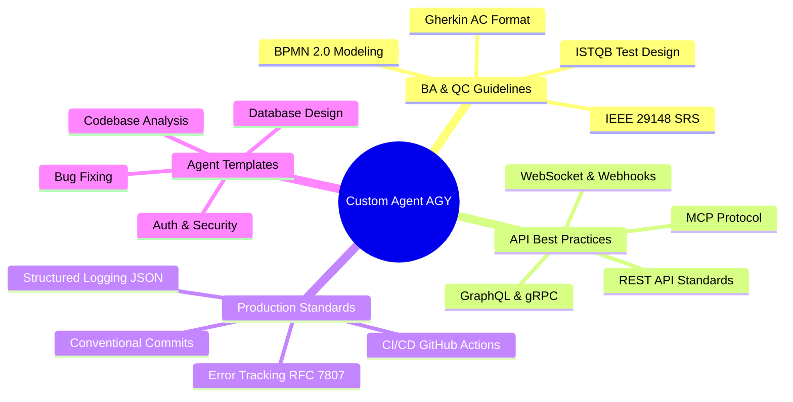
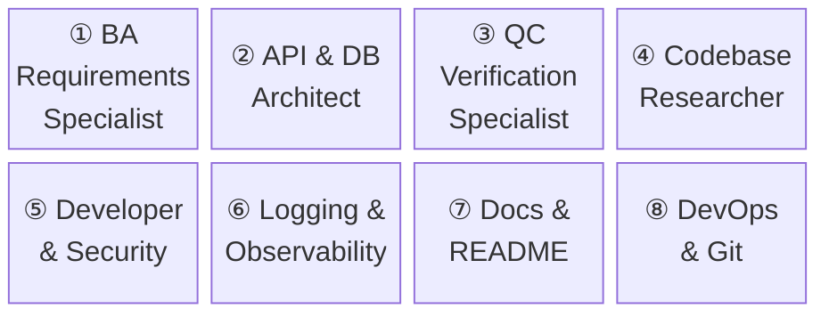
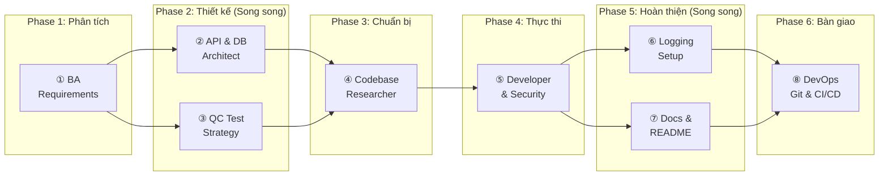
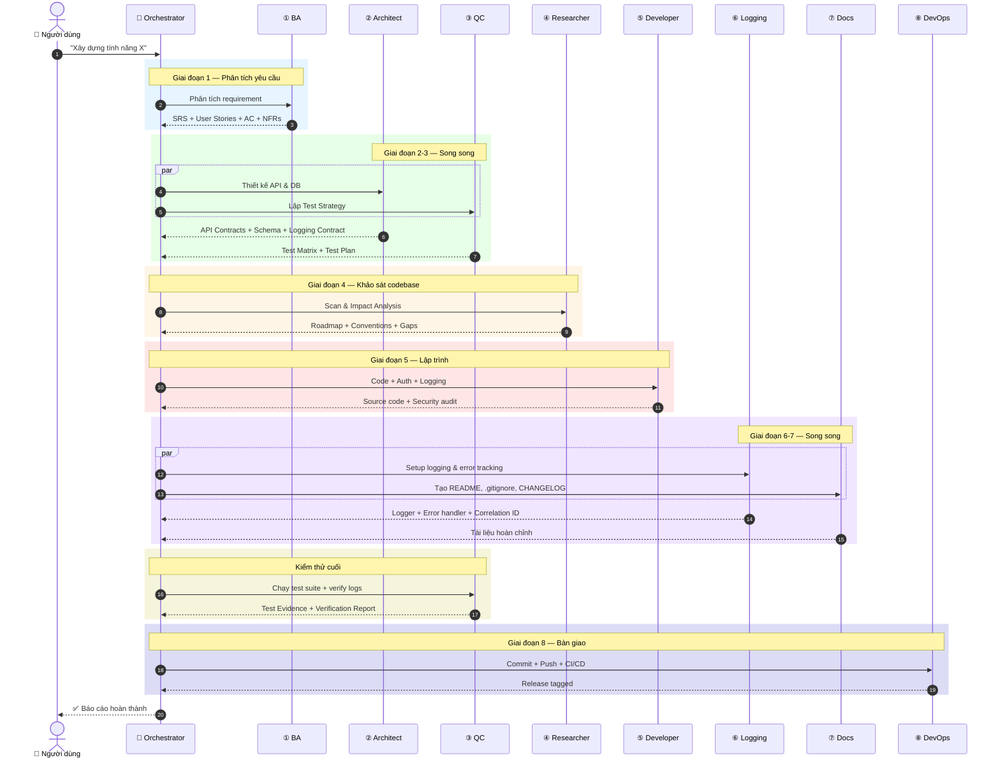
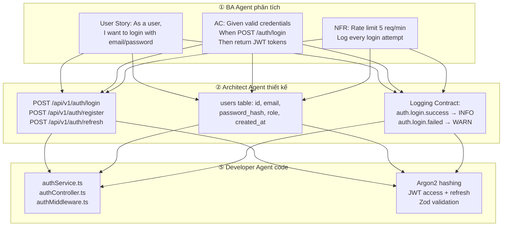
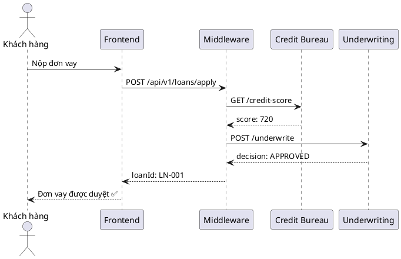

<p align="center">
  
</p>

<h1 align="center">Custom Agent AGY</h1>

<p align="center">
  <strong>Bộ 8 AI Agents chuyên biệt — phủ toàn bộ quy trình phát triển phần mềm từ phân tích yêu cầu đến triển khai production.</strong>
</p>

<p align="center">
  
  
  
  
  
</p>

---

## Mục Lục

- [Giới Thiệu](#giới-thiệu)
- [Triết Lý Thiết Kế](#triết-lý-thiết-kế)
- [Danh Sách 8 Agents](#danh-sách-8-agents)
- [Kiến Trúc Pipeline 8 Giai Đoạn](#kiến-trúc-pipeline-8-giai-đoạn)
- [Hướng Dẫn Cài Đặt & Sử Dụng](#hướng-dẫn-cài-đặt--sử-dụng)
- [Ví Dụ Thực Tế](#ví-dụ-thực-tế)
- [Tips & Tricks: BA Dùng AI Vẽ Flow Diagrams](#tips--tricks-ba-dùng-ai-vẽ-flow-diagrams)
- [Cấu Trúc Thư Mục](#cấu-trúc-thư-mục)
- [Tài Liệu Bổ Sung](#tài-liệu-bổ-sung)
- [Contributing](#contributing)
- [License](#license)

---

## Giới Thiệu

**Custom Agent AGY** là bộ sưu tập các **Custom Subagent System Prompts** được thiết kế để chạy trên nền tảng [Antigravity CLI](https://antigravity.dev) (v1.1.6+) hoặc bất kỳ AI Coding Agent nào hỗ trợ cơ chế `define_subagent` / `invoke_subagent`.

**Dành cho ai?**
- Solo developers muốn có quy trình phát triển chuẩn chỉnh như team chuyên nghiệp
- Team leads cần chuẩn hóa workflow cho đội ngũ
- Business Analysts muốn tận dụng AI cho requirement analysis & documentation
- Bất kỳ ai muốn tối ưu năng suất phát triển phần mềm với AI agents

**Tri thức tích hợp từ:**



---

## Triết Lý Thiết Kế

Tất cả agents được xây dựng trên 5 nguyên tắc cốt lõi, encode dưới dạng DSL để agent đọc hiểu:

```yaml
# design_philosophy.dsl
principles:
  - id: P1
    name: "Lựa chọn hơn nỗ lực"
    rule: "Chọn thư viện chuẩn công nghiệp (pino, Zod, Prisma), KHÔNG tự chế"
    example: "Dùng bcrypt/argon2 cho password hashing, không viết crypto riêng"

  - id: P2
    name: "Đơn giản hơn phức tạp"
    rule: "Early return, single responsibility, no premature abstraction"
    example: "Chỉ tách helper khi có >= 3 nơi dùng NGAY BÂY GIỜ"

  - id: P3
    name: "Hiệu suất có đo lường"
    rule: "Chỉ tối ưu nơi đo được bottleneck, không premature optimize"
    example: "Thêm index SAU KHI EXPLAIN cho thấy full table scan"

  - id: P4
    name: "Giám sát từ Dev đến Production"
    rule: "Structured logging, correlation ID, error tracking từ ngày đầu"
    example: "Mỗi request handler phải có requestId xuyên suốt"

  - id: P5
    name: "Mỗi dòng log phải có ý nghĩa"
    rule: "JSON structured, trả lời được: Gì xảy ra? Với ai? Kết quả?"
    example: |
      logger.info({
        event: "order.created",
        orderId: "ord_123",
        userId: "usr_456",
        duration: 145
      })

agent_structure:
  format: "4-part harness"
  sections:
    - "1. ROLE & IDENTITY — Vai trò và chuyên môn"
    - "2. SAFETY CONSTRAINTS — Hàng rào an toàn, điều cấm kỵ"
    - "3. QUALITY STANDARDS — Tiêu chuẩn chất lượng code & output"
    - "4. TOOLS & EXECUTION — Tools cụ thể + quy trình thực thi"
```

---

## Danh Sách 8 Agents



| # | Agent | File | Mô tả ngắn | Tools |
|:-:|-------|------|-------------|-------|
| ① | **BA Requirements Specialist** | [`ba-requirements-specialist.md`](ba-requirements-specialist.md) | Phân tích yêu cầu, User Stories, Acceptance Criteria (Gherkin), NFRs | read, write, search_web |
| ② | **API & DB Architect** | [`api-db-architect.md`](api-db-architect.md) | API Contracts (REST/GraphQL), DB Schema, Error Standard RFC 7807, Logging Contract | read, write |
| ③ | **QC Verification Specialist** | [`qc-verification-specialist.md`](qc-verification-specialist.md) | Test Matrix, Automation Tests (AAA Pattern), Log Verification, Regression | read, write, shell |
| ④ | **Codebase Researcher** | [`codebase-researcher.md`](codebase-researcher.md) | Scan codebase, Pattern Learning, Logging Audit, Impact Analysis, Roadmap | read, shell, search_web |
| ⑤ | **Developer & Security** | [`dev-security-implementer.md`](dev-security-implementer.md) | Code implementation, Auth/RBAC, Structured Logging JSON, Custom Error Classes | read, write, shell |
| ⑥ | **Logging & Observability** | [`logging-observability-specialist.md`](logging-observability-specialist.md) | Log Schema Design, Logger Setup (pino/structlog), Correlation ID, Error Tracking | read, write, shell, search_web |
| ⑦ | **Docs & README** | [`docs-readme-specialist.md`](docs-readme-specialist.md) | README.md, .gitignore, CHANGELOG, .env.example, Architecture Diagrams | read, write, search_web, generate_image |
| ⑧ | **DevOps & Git** | [`devops-git-specialist.md`](devops-git-specialist.md) | Conventional Commits, Branch Strategy, CI/CD Pipeline (GitHub Actions), SemVer | read, write, shell |

---

## Kiến Trúc Pipeline 8 Giai Đoạn

### Tổng quan luồng xử lý



### Luồng chi tiết (Sequence Diagram)



### Bản đồ thực thi song song

```
┌─────────────────────────────────────────────────────────────────┐
│ Timeline    T1      T2           T3        T4       T5     T6  │
│            ┌───┐  ┌───┬───┐   ┌───┐     ┌───┐   ┌───┬───┐┌──┐│
│ Agents     │ ① │→ │ ② │ ③ │→ │ ④ │  →  │ ⑤ │→ │ ⑥ │ ⑦ ││⑧ ││
│            │BA │  │Ar │QC │   │Res│     │Dev│   │Log│Doc││Gt ││
│            └───┘  └───┴───┘   └───┘     └───┘   └───┴───┘└──┘│
│                   (parallel)                     (parallel)    │
└─────────────────────────────────────────────────────────────────┘
```

---

## Hướng Dẫn Cài Đặt & Sử Dụng

### Yêu cầu

- [Antigravity CLI](https://antigravity.dev) >= 1.1.6 (hỗ trợ Custom Agents)
- Hoặc bất kỳ AI coding agent hỗ trợ `define_subagent` / `invoke_subagent`

### Cài đặt

```bash
git clone https://github.com/Le-Ngoc-Tu/custom_agent_agy.git
cd custom_agent_agy
```

### 3 Cách Sử Dụng

#### Cách 1: Kích hoạt toàn bộ Pipeline (Khuyến nghị)

Trong phiên Antigravity, yêu cầu:

```
Hãy dùng bộ custom agents trong E:\agent_resources\antigravity_custom_agents\
theo quy trình 8 giai đoạn để phát triển tính năng:

"Hệ thống đăng nhập/đăng ký với JWT, phân quyền RBAC, reset password qua email"
```

Antigravity sẽ tự động đọc các file `.md`, nạp từng agent qua `define_subagent` và điều phối theo pipeline.

#### Cách 2: Kích hoạt Agent đơn lẻ

```
Hãy đọc file ba-requirements-specialist.md và dùng nó làm system prompt
để define_subagent, rồi invoke nó để phân tích yêu cầu cho tính năng:
"Module quản lý đơn hàng với workflow: Draft → Confirmed → Shipping → Delivered"
```

#### Cách 3: Tham chiếu như Knowledge Base

```
Khi viết code cho API endpoint mới, hãy tham khảo file api-db-architect.md
để tuân thủ error format RFC 7807 và logging contract standards.
```

---

## Ví Dụ Thực Tế

### Use Case: Xây dựng hệ thống Authentication



### Ví dụ output từ ⑥ Logging Agent

```json
{
  "timestamp": "2026-07-25T14:00:00.000Z",
  "level": "info",
  "service": "auth-service",
  "traceId": "req_abc123",
  "event": "auth.login.success",
  "metadata": {
    "userId": "usr_456",
    "method": "POST",
    "path": "/api/v1/auth/login",
    "statusCode": 200,
    "duration": 145
  }
}
```

---

## Tips & Tricks: BA Dùng AI Vẽ Flow Diagrams

> **Mẹo thực tế:** Ngoài viết code, bộ agents này còn hỗ trợ BA/PM tạo tài liệu chuyên nghiệp với hình ảnh đẹp mắt.

### Vấn đề thực tế

Khi làm BA, bạn thường phải giải thích luồng hệ thống cho cả 2 phía:
- **Dev team** cần endpoint, payload, error codes
- **Stakeholders** chỉ cần biết "data chạy từ đâu sang đâu"

### Giải pháp: Dùng AI Agent + Mermaid/PlantUML

**Bước 1:** Yêu cầu agent vẽ flow bằng Mermaid:

```
Vẽ API flow diagram cho Loan Origination System:
1. User nộp form → Frontend
2. Frontend gọi Middleware
3. Middleware gọi Credit Bureau API lấy credit score
4. Middleware gửi data tổng hợp sang Underwriting API
5. Underwriting trả quyết định → User

Dùng Mermaid sequence diagram, label rõ từng component.
```

**Output Mermaid:**


**Bước 2:** Yêu cầu agent tóm tắt bằng ngôn ngữ nghiệp vụ:

```
Viết lại giải thích flow trên bằng ngôn ngữ nghiệp vụ cho stakeholders.
```

> **Output:** "Khi khách hàng nộp đơn xin vay, hệ thống tự động kiểm tra điểm tín dụng qua API của Trung tâm Thông tin Tín dụng. Sau đó, toàn bộ hồ sơ (thông tin cá nhân + điểm tín dụng) được gửi sang hệ thống Thẩm định để ra quyết định phê duyệt. Kết quả cuối cùng hiển thị lại cho khách hàng trên giao diện."

**Bước 3:** Kết hợp `⑦ Docs Agent` + tool `generate_image` để tạo hình ảnh cho tài liệu BRD:

```
Dùng agent docs-readme-specialist với tool generate_image
để tạo ảnh architecture diagram chuyên nghiệp cho tài liệu BRD
dự án Loan Origination System.
```

> **Kết quả:** Combo 1 hình trực quan cho Dev + 1 đoạn giải thích cho Sếp → bê thẳng vào BRD hoặc Confluence.

### PlantUML Alternative

Nếu team dùng PlantUML thay vì Mermaid, cùng flow trên sẽ là:



---

## Cấu Trúc Thư Mục

```
custom_agent_agy/
├── README.md                              # Tài liệu chính (file này)
├── .gitignore                             # Git ignore rules
├── full_lifecycle_workflow_guide.md        # Hướng dẫn điều phối 8 giai đoạn
├── assets/
│   └── banner.jpg                         # Banner image cho README
├── docs/
│   ├── USAGE_GUIDE.md                     # Hướng dẫn sử dụng chi tiết
│   └── TIPS_BA_AI_FLOW.md                 # Tips BA dùng AI vẽ Flow Diagrams
│
├── # --- 8 Custom Agent Prompts ---
├── ba-requirements-specialist.md          # ① BA Agent
├── api-db-architect.md                    # ② Architect Agent
├── qc-verification-specialist.md          # ③ QC Agent
├── codebase-researcher.md                 # ④ Researcher Agent
├── dev-security-implementer.md            # ⑤ Developer Agent
├── logging-observability-specialist.md    # ⑥ Logging Agent
├── docs-readme-specialist.md              # ⑦ Docs Agent
└── devops-git-specialist.md               # ⑧ DevOps Agent
```

---

## Tài Liệu Bổ Sung

| Tài liệu | Mô tả |
|-----------|--------|
| [Workflow Guide](full_lifecycle_workflow_guide.md) | Hướng dẫn điều phối đầy đủ 8 giai đoạn + Parallel Execution Map |
| [Usage Guide](docs/USAGE_GUIDE.md) | Hướng dẫn chi tiết từng agent: mô tả, prompt mẫu, output mẫu |
| [BA AI Flow Tips](docs/TIPS_BA_AI_FLOW.md) | Mẹo BA dùng AI vẽ Flow Diagrams + tạo tài liệu chuyên nghiệp |

---

## Contributing

1. Fork repository
2. Tạo branch: `git checkout -b feature/agent-improvement`
3. Commit theo **Conventional Commits**: `feat(agent): add new capability`
4. Push và tạo Pull Request

**Conventional Commits format:**

```
feat(scope): tính năng mới
fix(scope): sửa lỗi
docs: thay đổi tài liệu
refactor(scope): tái cấu trúc
test(scope): thêm/sửa tests
chore: build, CI, dependencies
```

---

## License

MIT License — Xem [LICENSE](LICENSE) để biết chi tiết.

---

<p align="center">
  <strong>Built with ❤️ by <a href="https://github.com/Le-Ngoc-Tu">Le Ngoc Tu</a></strong>
</p>
