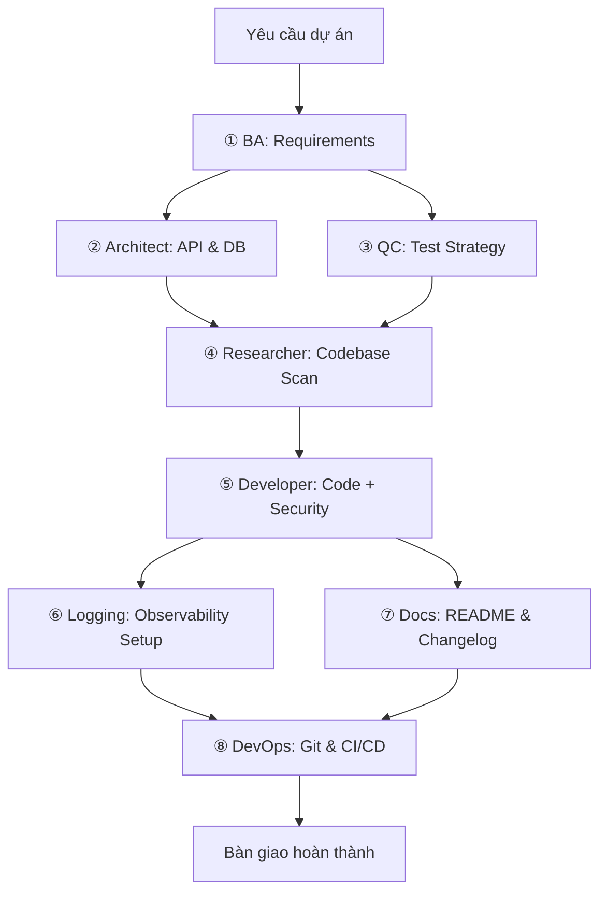

# Antigravity Custom Agents

> Bộ 8 Custom Subagent chuyên biệt cho Antigravity AI Assistant — phủ toàn bộ quy trình phát triển phần mềm từ phân tích yêu cầu đến triển khai production.


## Overview

Dự án này cung cấp bộ **Custom Subagent System Prompts** chuẩn hóa, thiết kế để chạy trên nền tảng **Antigravity CLI** (hoặc bất kỳ AI Coding Agent nào hỗ trợ `define_subagent` / `invoke_subagent`). Mỗi agent được xây dựng dựa trên nghiên cứu thực tế từ xu hướng Software Engineering 2025-2026, tích hợp tri thức từ:

- **BA & QC Guidelines** — IEEE 29148 SRS, ISTQB Test Design, Gherkin AC
- **API Best Practices** — REST, GraphQL, gRPC, WebSocket, Webhooks, MCP
- **Production-Grade Standards** — Structured Logging, Error Tracking, CI/CD, Conventional Commits

### Triết lý thiết kế

| Nguyên tắc | Ý nghĩa |
|------------|---------|
| **Lựa chọn hơn nỗ lực** | Chọn thư viện chuẩn công nghiệp, không tự chế |
| **Đơn giản hơn phức tạp** | Minimal viable solution, tối giản code thừa |
| **Hiệu suất** | Chỉ tối ưu nơi đo được bottleneck |
| **Giám sát từ Dev đến Production** | Structured logging, tracing, error tracking |
| **Mỗi dòng log phải có ý nghĩa** | JSON structured logs, correlation IDs, severity chuẩn |

## Agent Catalog

| # | Agent | File | Vai trò |
|---|-------|------|---------|
| ① | BA Requirements Specialist | `ba-requirements-specialist.md` | Phân tích yêu cầu, User Stories, Acceptance Criteria |
| ② | API & DB Architect | `api-db-architect.md` | Thiết kế API Contracts, Database Schema, Error Standards |
| ③ | QC Test Specialist | `qc-verification-specialist.md` | Test Matrix, Automation Tests, Log Verification |
| ④ | Codebase Researcher | `codebase-researcher.md` | Scan codebase, Impact Analysis, Implementation Roadmap |
| ⑤ | Developer & Security | `dev-security-implementer.md` | Code implementation, Auth/RBAC, Structured Logging |
| ⑥ | Logging & Observability | `logging-observability-specialist.md` | Log Schema, Error Tracking, Correlation ID, Monitoring |
| ⑦ | Docs & README | `docs-readme-specialist.md` | README, .gitignore, CHANGELOG, .env.example |
| ⑧ | DevOps & Git | `devops-git-specialist.md` | Conventional Commits, Branch Strategy, CI/CD, Release |

## Pipeline: 8-Stage Software Lifecycle



**Parallel Execution:**
- `② Architect` + `③ QC Test` chạy song song (không phụ thuộc nhau)
- `⑥ Logging` + `⑦ Docs` chạy song song (sau khi code xong)

## Getting Started

### Prerequisites

- [Antigravity CLI](https://antigravity.dev) >= 1.1.6 (hỗ trợ Custom Agents)
- Hoặc bất kỳ AI coding agent nào hỗ trợ `define_subagent`

### Usage

Trong phiên Antigravity, kích hoạt agent bằng cách yêu cầu:

```
Hãy dùng bộ custom agents trong E:\agent_resources\antigravity_custom_agents\
theo quy trình 8 giai đoạn để phát triển tính năng: [mô tả tính năng]
```

Hoặc kích hoạt từng agent riêng lẻ thông qua `define_subagent`.

### Tham khảo chi tiết

- [Workflow Guide](full_lifecycle_workflow_guide.md) — Hướng dẫn điều phối đầy đủ 8 giai đoạn

## Knowledge Sources

Bộ agents tích hợp tri thức từ các repository:

| Repository | Nội dung |
|-----------|---------|
| [ba-qc-skills](../ba-qc-skills/) | BA Requirements (IEEE 29148), QC Test Design (ISTQB), Automation Standards |
| [api-best-practices](../api-best-practices/) | REST, GraphQL, gRPC, WebSocket, Webhooks, SSE, SOAP, MCP best practices |

## Contributing

1. Fork repository
2. Tạo branch: `git checkout -b feature/agent-name-improvement`
3. Commit theo Conventional Commits: `feat(agent): add new capability`
4. Push và tạo Pull Request

## License

MIT License — Xem [LICENSE](LICENSE) để biết chi tiết.
