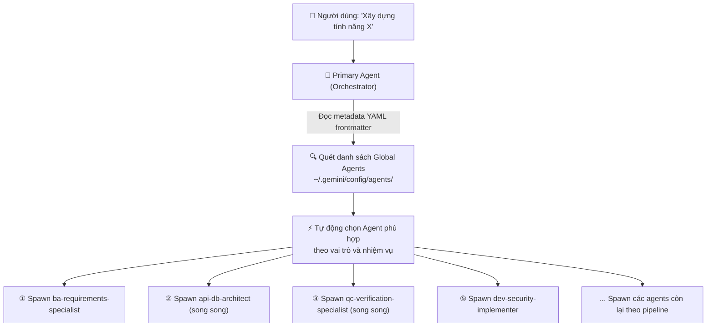
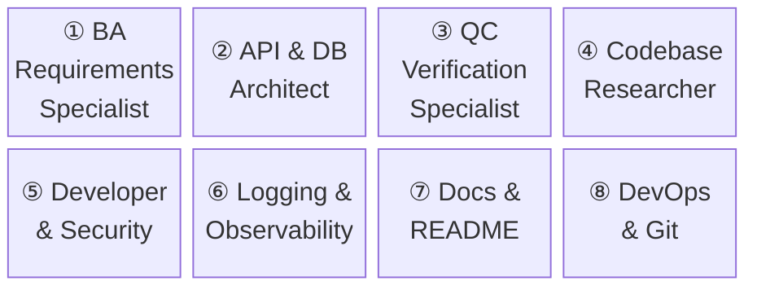
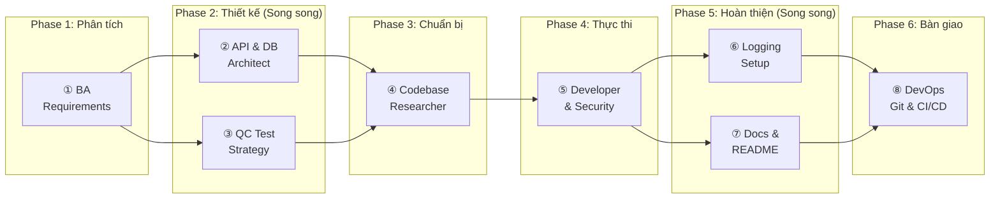
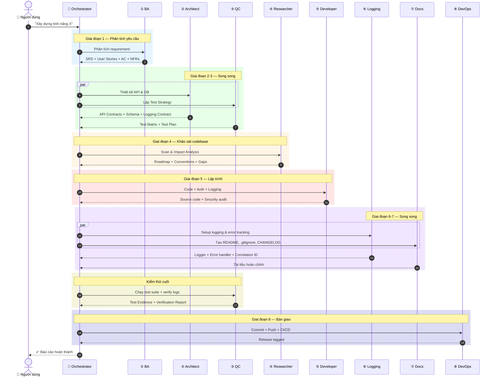
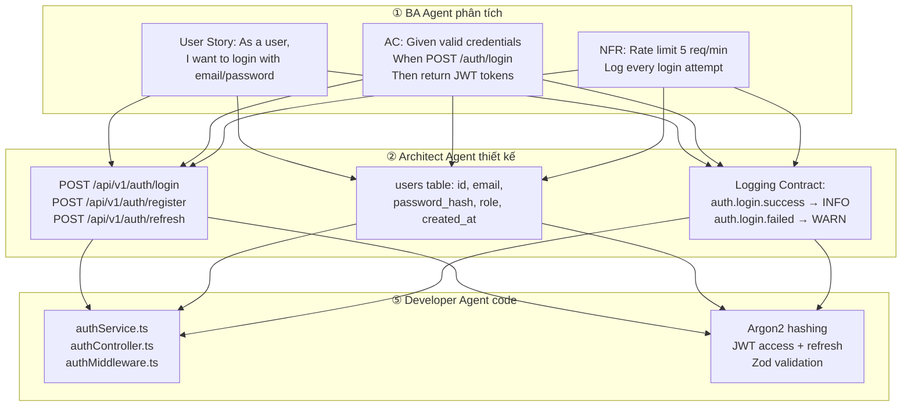
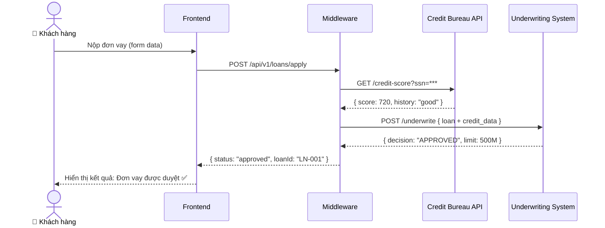

<p align="center">
  
</p>

<h1 align="center">Custom Agent AGY</h1>

<p align="center">
  <strong>Bộ 8 AI Agents chuyên biệt — phủ toàn bộ quy trình phát triển phần mềm từ phân tích yêu cầu đến triển khai production.</strong>
</p>

<p align="center">
  <a href="README.md"><strong>🇻🇳 Tiếng Việt</strong></a> | <a href="README_EN.md"><strong>🇺🇸 English</strong></a> | <a href="README_ZH.md"><strong>🇨🇳 简体中文</strong></a>
</p>

<p align="center">
  
  
  
  
  
</p>

---

## Mục Lục

- [Giới Thiệu](#giới-thiệu)
- [Cơ Chế Tự Động Chọn Agent & Spawn Subagents](#cơ-chế-tự-động-chọn-agent--spawn-subagents)
- [Triết Lý Thiết Kế Chi Tiết (Design Philosophy DSL)](#triết-lý-thiết-kế-chi-tiết-design-philosophy-dsl)
- [Danh Sách 8 Agents](#danh-sách-8-agents)
- [Kiến Trúc Pipeline 8 Giai Đoạn](#kiến-trúc-pipeline-8-giai-đoạn)
- [Cài Đặt Tự Động 1-Click Global](#cài-đặt-tự-động-1-click-global)
- [Cách Mở Bảng Điều Khiển (`/agents`)](#cách-mở-bảng-điều-khiển-agents)
- [Ví Dụ Thực Tế](#ví-dụ-thực-tế)
- [Tips & Tricks: BA Dùng AI Vẽ Flow Diagrams](#tips--tricks-ba-dùng-ai-vẽ-flow-diagrams)
- [Cấu Trúc Thư Mục](#cấu-trúc-thư-mục)
- [Tài Liệu Bổ Sung](#tài-liệu-bổ-sung)
- [Contributing](#contributing)
- [License](#license)

---

## Giới Thiệu

**Custom Agent AGY** là bộ sưu tập các **Custom System Prompts** được thiết kế để chạy trên nền tảng [Antigravity CLI](https://antigravity.dev) (v1.1.6+) hoặc bất kỳ AI Coding Agent nào hỗ trợ cơ chế `define_subagent` / `invoke_subagent`.

---

## Cơ Chế Tự Động Chọn Agent & Spawn Subagents

Trong phiên bản mới nhất của **Antigravity CLI (v1.1.6+)**, khi các custom agents đã được cài đặt vào hệ thống Global (`~/.gemini/config/agents/`), Antigravity sẽ tự động hoạt động theo cơ chế **Orchestrator Dynamic Spawning**:



---

## Triết Lý Thiết Kế Chi Tiết (Design Philosophy DSL)

Tất cả 8 agents được xây dựng dựa trên 5 nguyên tắc kỹ thuật cốt lõi và cấu trúc **4-Part Harness**, được mã hóa dưới dạng Machine-Readable DSL:

```yaml
# design_philosophy.dsl
version: "2.0.0"
description: "Bộ quy tắc thiết kế kiến trúc chuẩn mực dành cho AI Agents và Software Engineers"

principles:
  - id: P1
    name: "Kế thừa tiêu chuẩn công nghiệp"
    rationale: "Bài toán đã có giải pháp tin cậy được cộng đồng kiểm chứng thì không bao giờ viết lại từ đầu."
    rule: "Ưu tiên 100% việc sử dụng các thư viện chuẩn công nghiệp (như pino, Zod, Prisma, Argon2, Redis). KHÔNG tự chế crypto, validator, hay logger."
    boundary: "Chỉ viết custom code khi không có thư viện mã nguồn mở uy tín nào đáp ứng được yêu cầu."
    good_example: "Sử dụng Argon2id cho password hashing, Zod cho schema validation, Pino cho structured logging."
    bad_example: "Tự viết hàm hash mật khẩu bằng SHA256 + salt thủ công, hoặc tự dùng Regex phức tạp để validate email."

  - id: P2
    name: "Tối giản thiết kế, loại bỏ phức tạp thừa"
    rationale: "Mọi dòng code không cần thiết đều là nợ kỹ thuật (Tech Debt) và tiềm ẩn rủi ro lỗi."
    rule: "Áp dụng triệt để nguyên lý YAGNI (You Aren't Gonna Need It) & KISS. Code viết phẳng (flat code), ưu tiên early returns và single responsibility."
    boundary: "KHÔNG tách class trừu tượng, interface, hoặc helper utility trừ khi có ít nhất 3 nơi sử dụng THỰC TẾ NGAY BÂY GIỜ."
    good_example: |
      if (!user) return res.status(404).json({ error: "USER_NOT_FOUND" });
      if (!user.isActive) return res.status(403).json({ error: "USER_INACTIVE" });
    bad_example: "Tạo GenericAbstractBaseUserRepositoryFactoryImpl chỉ để thực hiện 1 câu lệnh SELECT đơn giản."

  - id: P3
    name: "Hiệu suất dựa trên dữ liệu đo lường thực tế"
    rationale: "Tối ưu hóa cảm tính khi chưa có dữ liệu đo lường chỉ làm code thêm phức tạp mà không đem lại giá trị."
    rule: "Chỉ tối ưu hóa hiệu năng khi có bằng chứng thực tế từ profiler, metrics, hoặc Database EXPLAIN Plan."
    boundary: "Mọi đề xuất thêm Database Index, Redis Cache, hoặc Worker Thread đều phải đi kèm kết quả đo lường trước/sau."
    good_example: "Chạy EXPLAIN ANALYZE thấy Full Table Scan -> Thêm Composite Index (user_id, status)."
    bad_example: "Bọc tất cả query vào Redis Cache dù bảng dữ liệu chỉ có 50 dòng data tĩnh."

  - id: P4
    name: "Giám sát toàn diện từ Dev đến Production"
    rationale: "Hệ thống không thể quan sát được (Unobservable) là hệ thống không thể vận hành tin cậy trên Production."
    rule: "Tính năng chỉ được coi là hoàn thành (Done) khi đã tích hợp sẵn Structured Logging, Correlation ID, và Error Tracking ngay từ dòng code đầu tiên."
    boundary: "Mọi HTTP Request, Cron Job, hay Message Queue phải truyền và kế thừa Correlation ID (requestId/traceId) xuyên suốt tất cả các tầng."
    good_example: "Header X-Request-ID được tạo từ Gateway/Middleware và tự động đính kèm vào mọi dòng log của request đó."
    bad_example: "Bắt được lỗi ở Controller nhưng log ra mà không có Trace ID để truy vết nguyên nhân ban đầu."

  - id: P5
    name: "Mỗi dòng log phải mang giá trị ngữ cảnh"
    rule: "Tất cả log output phải ở định dạng JSON Structured, chứa đầy đủ ngữ cảnh để máy tính và con người đều có thể query/filter chính xác."
    boundary: "KHÔNG dùng console.log('here'), console.log(err) hay chuỗi text không cấu trúc. Mỗi dòng log phải trả lời 4 câu hỏi: Chuyện gì xảy ra? Khi nào? Với đối tượng nào? Kết quả ra sao?"
    good_example: |
      logger.info({
        timestamp: "2026-07-25T16:20:00.000Z",
        level: "info",
        traceId: "req_xyz789",
        event: "order.payment_processed",
        metadata: { orderId: "ord_123", userId: "usr_456", amount: 500000, durationMs: 142 }
      })
    bad_example: "console.log('Payment success for order ' + orderId);"

agent_structure:
  format: "4-Part Harness Architecture"
  description: "Cấu trúc 4 phần bắt buộc cho mọi System Prompt Agent nhằm đảm bảo tính ổn định và kiểm soát an toàn tuyệt đối"
  sections:
    - section: 1
      name: "ROLE & IDENTITY"
      purpose: "Xác định rõ vai trò chuyên môn, phạm vi trách nhiệm và ranh giới hoạt động của Agent."
      mandatory_elements: ["Tên Agent", "Vai trò chuyên môn", "Phạm vi làm việc", "Tích hợp tri thức nền tảng"]

    - section: 2
      name: "SAFETY CONSTRAINTS"
      purpose: "Hàng rào bảo vệ nghiêm ngặt ngăn chặn các hành vi nguy hiểm, phá hoại hoặc sai lệch thiết kế."
      mandatory_elements: ["Quy tắc không phá hủy", "Giới hạn sửa đổi code", "Quy định validate đầu vào", "Quy tắc không đoán mò"]

    - section: 3
      name: "QUALITY STANDARDS"
      purpose: "Bộ tiêu chuẩn đầu ra đảm bảo sản phẩm đạt chất lượng Production."
      mandatory_elements: ["Tiêu chuẩn Code Sạch", "Quy chuẩn JSON Logging", "Chuẩn báo lỗi RFC 7807", "Tiêu chuẩn Test & Docs"]

    - section: 4
      name: "TOOLS & EXECUTION"
      purpose: "Quy trình thực thi 3-4 bước rõ ràng cùng danh sách các Tools được cấp phép."
      mandatory_elements: ["Danh sách Tools khả dụng", "Quy trình thực thi theo từng bước", "Định dạng Output mẫu"]
```

---

## Danh Sách 8 Agents



| # | Agent | File | Mô tả ngắn | Tools |
|:-:|-------|------|-------------|-------|
| ① | **BA Requirements Specialist** | [`ba-requirements-specialist.md`](ba-requirements-specialist.md) | Phân tích yêu cầu, User Stories, Acceptance Criteria (Gherkin), NFRs | read, write, search_web |
| ② | **API & DB Architect** | [`api-db-architect.md`](api-db-architect.md) | API Contracts (REST/GraphQL), DB Schema, Error Standard RFC 7807, Logging Contract | read, write |
| ③ | **QC Verification Specialist** | [`qc-verification-specialist.md`](qc-verification-specialist.md) | Test Matrix, Automation Tests (AAA Pattern), Log Verification, Regression | read, write, shell |
| ④ | **Codebase Researcher** | [`codebase-researcher.md`](codebase-researcher.md) | Scan codebase, Pattern Learning, Logging Audit, Impact Analysis, Roadmap | read, shell, search_web |
| ⑤ | **Developer & Security** | [`dev-security-implementer.md`](dev-security-implementer.md) | Code implementation, Auth/RBAC, Structured Logging JSON, Custom Error Classes | read, write, shell |
| ⑥ | **Logging & Observability** | [`logging-observability-specialist.md`](logging-observability-specialist.md) | Log Schema Design, Logger Setup (pino/structlog), Correlation ID, Error Tracking | read, write, shell, search_web |
| ⑦ | **Docs & README** | [`docs-readme-specialist.md`](docs-readme-specialist.md) | README.md, .gitignore, CHANGELOG, .env.example, Architecture Diagrams | read, write, search_web, generate_image |
| ⑧ | **DevOps & Git** | [`devops-git-specialist.md`](devops-git-specialist.md) | Conventional Commits, Branch Strategy, CI/CD Pipeline (GitHub Actions), SemVer | read, write, shell |

---

## Kiến Trúc Pipeline 8 Giai Đoạn

### Tổng quan luồng xử lý



### Luồng chi tiết (Sequence Diagram)



---

## Cài Đặt Tự Động 1-Click Global

Sau khi clone repo về máy, bạn chỉ cần chạy **1 lệnh duy nhất** để cài đặt toàn bộ 8 agents vào hệ thống Global Config của Antigravity CLI (`~/.gemini/config/agents/`):

### Trên Windows (PowerShell):

```powershell
.\scripts\setup_global.ps1
```

### Trên Linux / macOS (Bash):

```bash
bash scripts/setup_global.sh
```

---

## Cách Mở Bảng Điều Khiển (`/agents`)

Trong Antigravity CLI, gõ lệnh sau để mở giao diện quản lý agents:

```bash
/agents
```

### Màn hình quản lý Agents (TUI Panel)

Giao diện sẽ tự động quét và hiển thị cả 8 custom agents dưới mục **Available Agents**:

```
┌─────────────────────────────────────────────────────────────┐
│                       AGENTS MANAGER                        │
├─────────────────────────────────────────────────────────────┤
│ Available Agents                                            │
│   ● Default Agent                                           │
│     ba-requirements-specialist                              │
│     api-db-architect                                        │
│     qc-verification-specialist                              │
│     codebase-researcher                                     │
│     dev-security-implementer                                │
│     logging-observability-specialist                        │
│     docs-readme-specialist                                  │
│     devops-git-specialist                                   │
└─────────────────────────────────────────────────────────────┘
```

1. **Chọn Agent:** Phím `↑ / ↓` để chọn, nhấn `Enter` để kích hoạt (`●` biểu tượng màu xanh).
2. **Áp dụng:** Nhấn `Esc` để đóng panel và bắt đầu chat với agent được chọn.

---

## Ví Dụ Thực Tế

### Use Case: Xây dựng hệ thống Authentication



---

## Tips & Tricks: BA Dùng AI Vẽ Flow Diagrams

> **Mẹo thực tế:** Ngoài viết code, bộ agents này còn hỗ trợ BA/PM tạo tài liệu chuyên nghiệp với hình ảnh đẹp mắt.

### Vấn đề thực tế

Khi làm BA, bạn thường đứng giữa ngã ba đường:
- **Dev team** cần endpoint, payload, error codes
- **Stakeholders** chỉ cần biết "data chạy từ đâu sang đâu"

### Giải pháp: Dùng AI Agent + Mermaid/PlantUML



---

## Cấu Trúc Thư Mục

```
custom_agent_agy/
├── README.md                              # Tài liệu chính (Tiếng Việt)
├── README_EN.md                           # Main English README
├── README_ZH.md                           # 简体中文 README
├── LICENSE                                # MIT License
├── CONTRIBUTING.md                        # Hướng dẫn đóng góp
├── CODE_OF_CONDUCT.md                     # Quy tắc ứng xử cộng đồng
├── SECURITY.md                            # Chính sách bảo mật
├── .gitignore                             # Git ignore rules (2 lớp)
├── full_lifecycle_workflow_guide.md        # Hướng dẫn điều phối 8 giai đoạn
│
├── .github/
│   ├── ISSUE_TEMPLATE/
│   │   ├── bug_report.yml                 # Mẫu báo lỗi
│   │   └── feature_request.yml            # Mẫu đề xuất tính năng
│   ├── PULL_REQUEST_TEMPLATE.md           # Checklist PR
│   └── workflows/
│       └── ci.yml                         # GitHub Actions CI
│
├── assets/
│   └── banner.jpg                         # Banner image cho README
├── scripts/
│   ├── setup_global.ps1                   # 1-Click setup cho Windows
│   └── setup_global.sh                    # 1-Click setup cho Linux/macOS
├── docs/
│   ├── USAGE_GUIDE.md                     # Hướng dẫn sử dụng chi tiết
│   └── TIPS_BA_AI_FLOW.md                 # Tips BA dùng AI vẽ Flow Diagrams
│
├── ba-requirements-specialist.md          # ① BA Agent
├── api-db-architect.md                    # ② Architect Agent
├── qc-verification-specialist.md          # ③ QC Agent
├── codebase-researcher.md                 # ④ Researcher Agent
├── dev-security-implementer.md            # ⑤ Developer Agent
├── logging-observability-specialist.md    # ⑥ Logging Agent
├── docs-readme-specialist.md              # ⑦ Docs Agent
└── devops-git-specialist.md               # ⑧ DevOps Agent
```

---

## Tài Liệu Bổ Sung

| Tài liệu | Mô tả |
|-----------|--------|
| [English Version](README_EN.md) | Full English documentation of Custom Agent AGY |
| [Chinese Version](README_ZH.md) | Custom Agent AGY 简体中文完整文档 |
| [Workflow Guide](full_lifecycle_workflow_guide.md) | Hướng dẫn điều phối đầy đủ 8 giai đoạn + Parallel Execution Map |
| [Usage Guide](docs/USAGE_GUIDE.md) | Hướng dẫn chi tiết từng agent: mô tả, prompt mẫu, output mẫu |
| [BA AI Flow Tips](docs/TIPS_BA_AI_FLOW.md) | Mẹo BA dùng AI vẽ Flow Diagrams + tạo tài liệu chuyên nghiệp |

---

## Contributing

1. Fork repository
2. Tạo branch: `git checkout -b feature/agent-name-improvement`
3. Commit theo Conventional Commits: `feat(agent): add new capability`
4. Push và tạo Pull Request

---

## License

MIT License — Xem [LICENSE](LICENSE) để biết chi tiết.

---

<p align="center">
  <strong>Built with ❤️ by <a href="https://github.com/Le-Ngoc-Tu">Le Ngoc Tu</a></strong>
</p>
