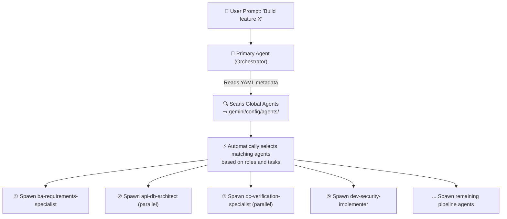
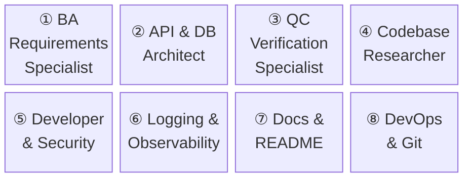
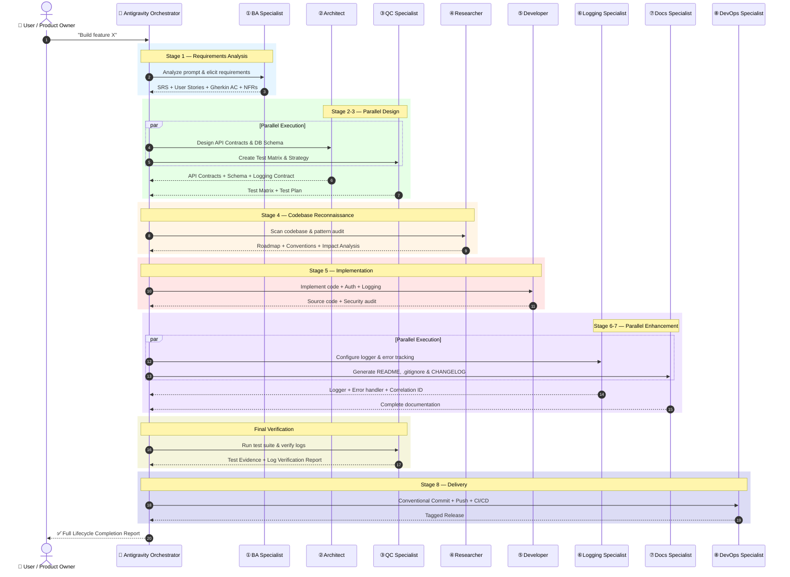

<p align="center">
  
</p>

<h1 align="center">Custom Agent AGY</h1>

<p align="center">
  <strong>A suite of 8 specialized AI Agents covering the full software development lifecycle from requirements analysis to production deployment.</strong>
</p>

<p align="center">
  <a href="README.md"><strong>🇻🇳 Tiếng Việt</strong></a> | <a href="README_EN.md"><strong>🇺🇸 English</strong></a>
</p>

<p align="center">
  
  
  
  
  
</p>

---

## Table of Contents

- [Overview](#overview)
- [Auto Agent Selection & Dynamic Spawning](#auto-agent-selection--dynamic-spawning)
- [Design Philosophy](#design-philosophy)
- [8 Agents Catalog](#8-agents-catalog)
- [8-Stage Pipeline Architecture](#8-stage-pipeline-architecture)
- [Automated 1-Click Global Installation](#automated-1-click-global-installation)
- [How to Select Agents (`/agents` Panel)](#how-to-select-agents-agents-panel)
- [Usage Examples](#usage-examples)
- [Tips & Tricks: How BAs Use AI to Draw Flow Diagrams](#tips--tricks-how-bas-use-ai-to-draw-flow-diagrams)
- [Project Structure](#project-structure)
- [Additional Documentation](#additional-documentation)
- [Contributing](#contributing)
- [License](#license)

---

## Overview

**Custom Agent AGY** is a production-grade collection of **Custom System Prompts** designed for [Antigravity CLI](https://antigravity.dev) (v1.1.6+) and compatible AI coding assistants supporting subagents and custom agent definitions.

**Target Audience:**
- Solo developers aiming for enterprise-grade engineering standards
- Engineering leads standardizing team workflows
- Business Analysts leveraging AI for requirements engineering & documentation
- Software developers optimizing productivity through multi-agent orchestration

---

## Auto Agent Selection & Dynamic Spawning

In **Antigravity CLI (v1.1.6+)**, once custom agents are installed in your global config (`~/.gemini/config/agents/`), Antigravity operates using **Orchestrator Dynamic Spawning**:



### Key Highlights:

1. **Automatic Selection:** No need to manually pick agents for complex tasks. The Orchestrator automatically parses the YAML frontmatter (`name` and `description`) to select the ideal agent for each task.
2. **Dynamic Subagent Spawning:** The Orchestrator automatically invokes `invoke_subagent` to spawn agents in parallel (e.g., Architect + QC Test) or sequentially across the 8-stage pipeline.
3. **Manual Selection (Optional):** You can still open `/agents` in the TUI at any time to switch agents manually.

---

## Design Philosophy

All agents adhere to 5 core principles encoded as a machine-readable DSL:

```yaml
# design_philosophy.dsl
principles:
  - id: P1
    name: "Choice over effort"
    rule: "Use industry-standard libraries (pino, Zod, Prisma); DO NOT reinvent the wheel"
    example: "Use bcrypt/argon2 for password hashing instead of custom cryptography"

  - id: P2
    name: "Simplicity over complexity"
    rule: "Early returns, single responsibility, no premature abstractions"
    example: "Only extract helper utilities when reused >= 3 times NOW"

  - id: P3
    name: "Measured performance"
    rule: "Optimize strictly where bottlenecks are measured; avoid premature optimization"
    example: "Add database indexes AFTER EXPLAIN queries reveal full table scans"

  - id: P4
    name: "Dev-to-Production Observability"
    rule: "Structured logging, correlation IDs, and error tracking from day one"
    example: "Every request handler must propagate requestId end-to-end"

  - id: P5
    name: "Meaningful log entries"
    rule: "JSON structured logs answering: What happened? To whom? What result?"
    example: |
      logger.info({
        event: "order.created",
        orderId: "ord_123",
        userId: "usr_456",
        duration: 145
      })

agent_structure:
  format: "4-part harness"
  sections:
    - "1. ROLE & IDENTITY — Clear specialization and domain boundary"
    - "2. SAFETY CONSTRAINTS — Explicit guardrails and forbidden actions"
    - "3. QUALITY STANDARDS — Code & deliverable quality criteria"
    - "4. TOOLS & EXECUTION — Exact tools and 3-4 step execution workflow"
```

---

## 8 Agents Catalog



| # | Agent | Prompt File | Description | Tools |
|:-:|-------|-------------|-------------|-------|
| ① | **BA Requirements Specialist** | [`ba-requirements-specialist.md`](ba-requirements-specialist.md) | Requirements analysis, User Stories, Gherkin Acceptance Criteria, NFRs | read, write, search_web |
| ② | **API & DB Architect** | [`api-db-architect.md`](api-db-architect.md) | REST/GraphQL API contracts, DB schema, RFC 7807 error format, logging contract | read, write |
| ③ | **QC Verification Specialist** | [`qc-verification-specialist.md`](qc-verification-specialist.md) | Test matrix, AAA pattern unit/integration tests, log verification, regression tests | read, write, shell |
| ④ | **Codebase Researcher** | [`codebase-researcher.md`](codebase-researcher.md) | Codebase scanning, pattern discovery, logging audit, impact analysis, roadmap | read, shell, search_web |
| ⑤ | **Developer & Security** | [`dev-security-implementer.md`](dev-security-implementer.md) | Secure code implementation, Auth/RBAC, JSON structured logging, Custom error classes | read, write, shell |
| ⑥ | **Logging & Observability** | [`logging-observability-specialist.md`](logging-observability-specialist.md) | Log schema design, logger setup (pino/structlog), correlation ID, global error handling | read, write, shell, search_web |
| ⑦ | **Docs & README** | [`docs-readme-specialist.md`](docs-readme-specialist.md) | README generation, 2-layer .gitignore, CHANGELOG, .env.example, architecture diagrams | read, write, search_web, generate_image |
| ⑧ | **DevOps & Git** | [`devops-git-specialist.md`](devops-git-specialist.md) | Conventional Commits, GitHub Flow, CI/CD pipeline (GitHub Actions), SemVer releases | read, write, shell |

---

## 8-Stage Pipeline Architecture

### Detailed Sequence Diagram



---

## Automated 1-Click Global Installation

After cloning the repository, install all 8 agents into your global Antigravity config directory (`~/.gemini/config/agents/`) with **a single command**:

### On Windows (PowerShell):

```powershell
.\scripts\setup_global.ps1
```

### On Linux / macOS (Bash):

```bash
bash scripts/setup_global.sh
```

---

## How to Select Agents (`/agents` Panel)

Antigravity CLI provides an interactive TUI panel to switch between custom agents seamlessly:

1. Open the panel by typing inside Antigravity CLI:
   ```bash
   /agents
   ```
2. Navigate to **Available Agents** using `↑` / `↓`.
3. Select any of the 8 custom agents and press `Enter`.
4. Press `Esc` to close the panel and apply your selection.

```
┌─────────────────────────────────────────────────────────────┐
│                       AGENTS MANAGER                        │
├─────────────────────────────────────────────────────────────┤
│ Available Agents                                            │
│   ● Default Agent                                           │
│     ba-requirements-specialist                              │
│     api-db-architect                                        │
│     qc-verification-specialist                              │
│     codebase-researcher                                     │
│     dev-security-implementer                                │
│     logging-observability-specialist                        │
│     docs-readme-specialist                                  │
│     devops-git-specialist                                   │
└─────────────────────────────────────────────────────────────┘
```

---

## Project Structure

```
custom_agent_agy/
├── README.md                              # Main Vietnamese README
├── README_EN.md                           # Main English README
├── .gitignore                             # 2-Layer Git ignore
├── full_lifecycle_workflow_guide.md        # 8-stage workflow guide
├── assets/
│   └── banner.jpg                         # Repository banner image
├── scripts/
│   ├── setup_global.ps1                   # 1-Click setup script for Windows
│   └── setup_global.sh                    # 1-Click setup script for Linux/macOS
├── docs/
│   ├── USAGE_GUIDE.md                     # Per-agent usage guide
│   └── TIPS_BA_AI_FLOW.md                 # BA AI flow diagrams guide
│
├── # --- 8 Custom Agent Prompts ---
├── ba-requirements-specialist.md          # ① BA Agent
├── api-db-architect.md                    # ② Architect Agent
├── qc-verification-specialist.md          # ③ QC Agent
├── codebase-researcher.md                 # ④ Researcher Agent
├── dev-security-implementer.md            # ⑤ Developer Agent
├── logging-observability-specialist.md    # ⑥ Logging Agent
├── docs-readme-specialist.md              # ⑦ Docs Agent
└── devops-git-specialist.md               # ⑧ DevOps Agent
```

---

## Additional Documentation

| Document | Description |
|----------|-------------|
| [Workflow Guide](full_lifecycle_workflow_guide.md) | Full 8-stage orchestration guide and parallel execution rules |
| [Usage Guide](docs/USAGE_GUIDE.md) | In-depth reference for each agent: goals, triggers, prompts & outputs |
| [BA AI Flow Tips](docs/TIPS_BA_AI_FLOW.md) | Guide for BAs using AI for API flow diagrams & BRD documents |

---

## Contributing

1. Fork the repository
2. Create your branch: `git checkout -b feature/agent-enhancement`
3. Commit using **Conventional Commits**: `feat(agent): add new capability`
4. Push and submit a Pull Request

---

## License

MIT License — see [LICENSE](LICENSE) for details.

---

<p align="center">
  <strong>Built with ❤️ by <a href="https://github.com/Le-Ngoc-Tu">Le Ngoc Tu</a></strong>
</p>
