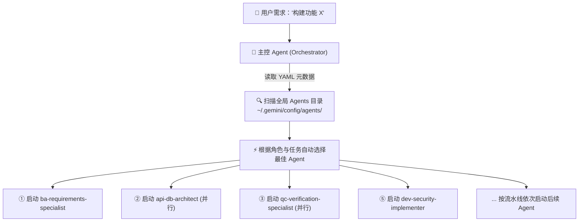
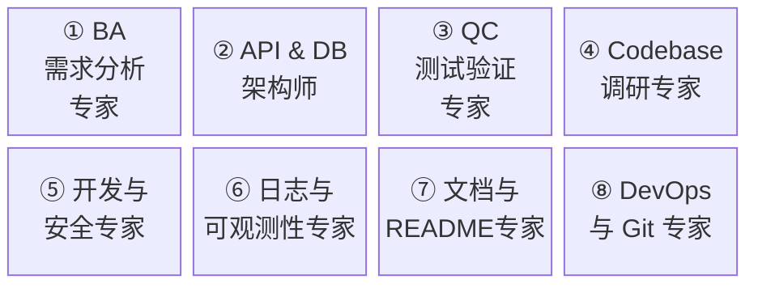
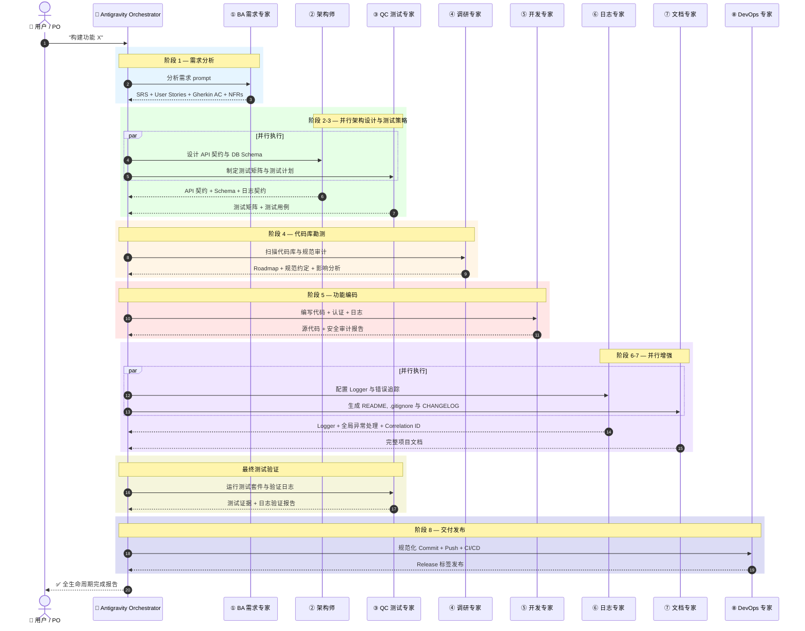

<p align="center">
  
</p>

<h1 align="center">Custom Agent AGY</h1>

<p align="center">
  <strong>专为 Antigravity CLI 打造的 8 个专业 AI Agent 套件，覆盖从需求分析、架构设计、安全编码、日志规范、质量测试到 DevOps 的软件开发全生命周期。</strong>
</p>

<p align="center">
  <a href="README.md"><strong>🇻🇳 Tiếng Việt</strong></a> | <a href="README_EN.md"><strong>🇺🇸 English</strong></a> | <a href="README_ZH.md"><strong>🇨🇳 简体中文</strong></a>
</p>

<p align="center">
  
  
  
  
  
</p>

---

## 目录

- [项目概述](#项目概述)
- [自动 Agent 选择与动态 Spawn 机制](#自动-agent-选择与动态-spawn-机制)
- [核心设计哲学](#核心设计哲学)
- [8 大 Agent 目录](#8-大-agent-目录)
- [8 阶段流水线架构](#8-阶段流水线架构)
- [一键全局安装](#一键全局安装)
- [如何使用面板选择 Agent (`/agents`)](#如何使用面板选择-agent-agents)
- [实际应用示例](#实际应用示例)
- [BA 技巧：如何使用 AI 绘制流程图](#ba-技巧如何使用-ai-绘制流程图)
- [目录结构](#目录结构)
- [补充文档](#补充文档)
- [贡献指南](#贡献指南)
- [开源协议](#开源协议)

---

## 项目概述

**Custom Agent AGY** 是专为 [Antigravity CLI](https://antigravity.dev) (v1.1.6+) 及支持 Subagent 机制的 AI 编码助手量身定制的**生产级 Custom System Prompts** 集合。

**适用人群：**
- 追求企业级工程标准的独立开发者 (Solo Developer)
- 寻求标准化团队开发工作流的技术 Leader
- 借助 AI 进行需求工程与文档撰写的业务分析师 (BA)
- 希望通过多 Agent 协作提升生产力的软件工程师

---

## 自动 Agent 选择与动态 Spawn 机制

在最新的 **Antigravity CLI (v1.1.6+)** 中，只需将 Custom Agent 安装至全局配置目录 (`~/.gemini/config/agents/`)，系统即可实现 **Orchestrator 动态 Spawn 协作**：



### 核心亮点：

1. **自动选择 Agent：** 无需手动切换。主控 Agent 自动解析 YAML frontmatter (`name` 与 `description`) 匹配最佳 Agent。
2. **动态 Subagent 调度：** 自动调用 `invoke_subagent` 实现并行（如架构设计与测试用例同时进行）或串行调度。
3. **手动切换支持：** 随时可在 CLI 中输入 `/agents` 调出 TUI 面板进行手动切换。

---

## 核心设计哲学

所有 Agent 遵循 5 大核心原则，并以 DSL 格式编码供 Agent 解析：

```yaml
# design_philosophy.dsl
principles:
  - id: P1
    name: "选择高于努力"
    rule: "优先使用工业级标准库 (pino, Zod, Prisma)，切勿重复造轮子"
    example: "使用 bcrypt/argon2 进行密码哈希，不自定义加密算法"

  - id: P2
    name: "简约高于复杂"
    rule: "早返回、单一职责，拒绝过早抽象"
    example: "仅在当下重复使用 >= 3 次时才抽取 Helper 函数"

  - id: P3
    name: "可量化的性能"
    rule: "仅在测量出瓶颈处进行针对性优化"
    example: "在 EXPLAIN 分析确认全表扫描后才添加数据库索引"

  - id: P4
    name: "贯穿开发至生产的可观测性"
    rule: "从第一天起配置结构化日志、Correlation ID 与错误追踪"
    example: "每个 Request Handler 必须端到端传递 requestId"

  - id: P5
    name: "每一行日志必须具备实际意义"
    rule: "JSON 结构化日志，明确回答：发生了什么？涉及谁？结果如何？"
    example: |
      logger.info({
        event: "order.created",
        orderId: "ord_123",
        userId: "usr_456",
        duration: 145
      })

agent_structure:
  format: "4-part harness"
  sections:
    - "1. ROLE & IDENTITY — 明确角色定位与专业边界"
    - "2. SAFETY CONSTRAINTS — 明确安全防线与禁忌行为"
    - "3. QUALITY STANDARDS — 代码与交付物质量标准"
    - "4. TOOLS & EXECUTION — 具体工具链与 3-4 步执行流程"
```

---

## 8 大 Agent 目录



| # | Agent 名称 | Prompt 文件 | 职责描述 | 工具链 |
|:-:|-----------|-------------|----------|-------|
| ① | **BA Requirements Specialist** | [`ba-requirements-specialist.md`](ba-requirements-specialist.md) | 需求工程、User Stories、Gherkin 标准 Acceptance Criteria、NFRs | read, write, search_web |
| ② | **API & DB Architect** | [`api-db-architect.md`](api-db-architect.md) | REST/GraphQL API 契约、DB Schema、RFC 7807 错误标准、日志契约 | read, write |
| ③ | **QC Verification Specialist** | [`qc-verification-specialist.md`](qc-verification-specialist.md) | 测试矩阵、AAA 模式单元/集成测试、日志验证、回归测试 | read, write, shell |
| ④ | **Codebase Researcher** | [`codebase-researcher.md`](codebase-researcher.md) | 代码库扫描、模式挖掘、日志审计、影响分析、Roadmap 规划 | read, shell, search_web |
| ⑤ | **Developer & Security** | [`dev-security-implementer.md`](dev-security-implementer.md) | 安全编码、Auth/RBAC、JSON 结构化日志、自定义异常类 | read, write, shell |
| ⑥ | **Logging & Observability** | [`logging-observability-specialist.md`](logging-observability-specialist.md) | 日志 Schema 设计、Logger 配置 (pino/structlog)、Correlation ID、全局异常捕捉 | read, write, shell, search_web |
| ⑦ | **Docs & README** | [`docs-readme-specialist.md`](docs-readme-specialist.md) | README 生成、双层 .gitignore、CHANGELOG、.env.example、架构图生成 | read, write, search_web, generate_image |
| ⑧ | **DevOps & Git** | [`devops-git-specialist.md`](devops-git-specialist.md) | Conventional Commits 规范、GitHub Flow、CI/CD Pipeline (GitHub Actions)、SemVer 版本发布 | read, write, shell |

---

## 8 阶段流水线架构

### 详细 Sequence Diagram



---

## 一键全局安装

克隆仓库后，仅需运行**一条命令**即可将全部 8 个 Agent 自动安装至全局配置目录 (`~/.gemini/config/agents/`)：

### Windows (PowerShell)：

```powershell
.\scripts\setup_global.ps1
```

### Linux / macOS (Bash)：

```bash
bash scripts/setup_global.sh
```

---

## 如何使用面板选择 Agent (`/agents`)

在 Antigravity CLI 中输入以下命令唤出交互式 TUI 面板：

```bash
/agents
```

在 **Available Agents** 列表中选择所需 Agent 即可开启专属对话。

---

## 补充文档

| 文档 | 描述 |
|------|------|
| [English Version](README_EN.md) | Custom Agent AGY 英文完整文档 |
| [Vietnamese Version](README.md) | Custom Agent AGY 越南语完整文档 |
| [Workflow Guide](full_lifecycle_workflow_guide.md) | 8 阶段流水线编排指南与并行执行规则 |
| [Usage Guide](docs/USAGE_GUIDE.md) | 各 Agent 详细使用手册：目标、Prompt 模板与输出示例 |
| [BA AI Flow Tips](docs/TIPS_BA_AI_FLOW.md) | BA 使用 AI 绘制流程图与撰写 BRD 文档指南 |

---

## 贡献指南

欢迎提交 Issue 或 Pull Request！请参阅 [CONTRIBUTING.md](CONTRIBUTING.md) 了解详细规范。

---

## 开源协议

基于 [MIT License](LICENSE) 开源。

---

<p align="center">
  <strong>Built with ❤️ by <a href="https://github.com/Le-Ngoc-Tu">Le Ngoc Tu</a></strong>
</p>
