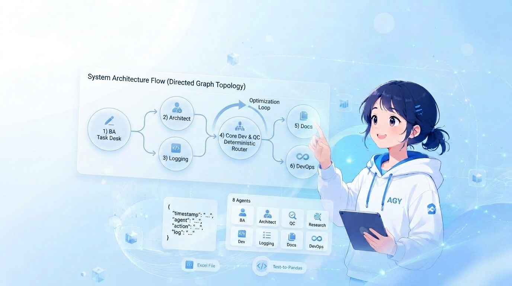
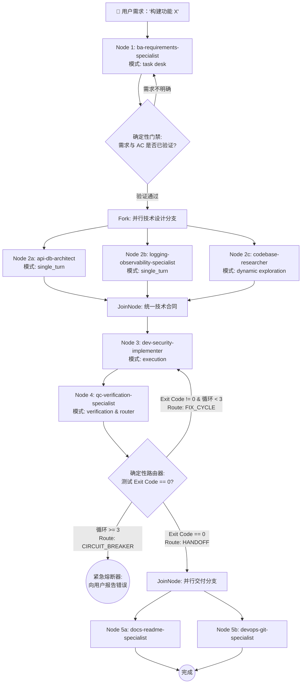
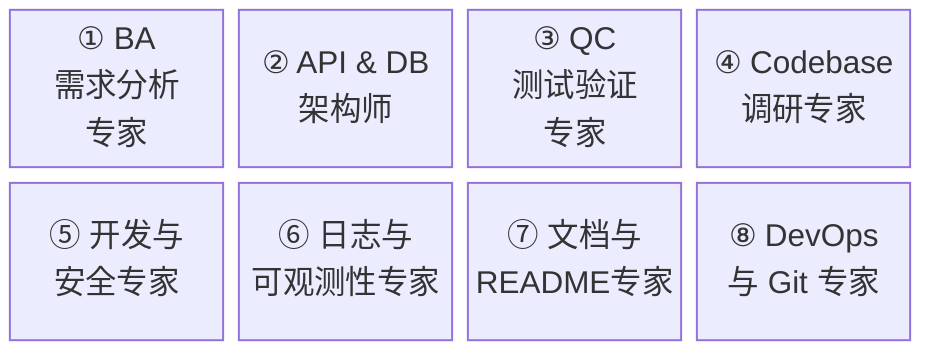
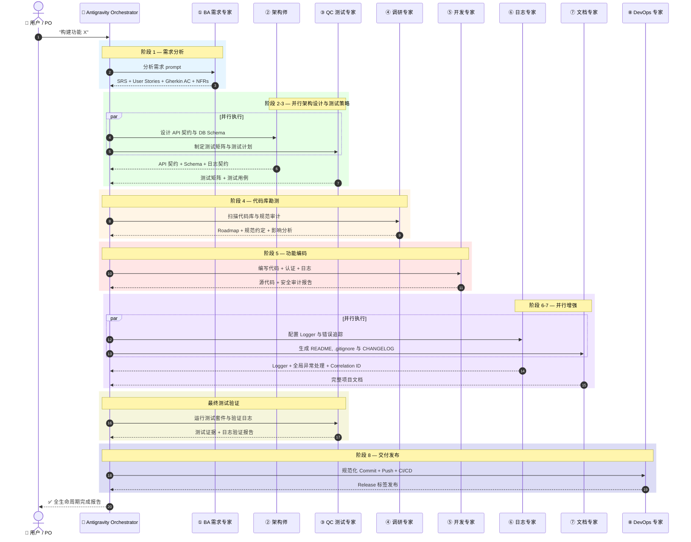
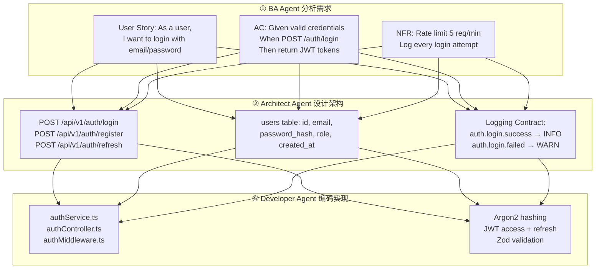
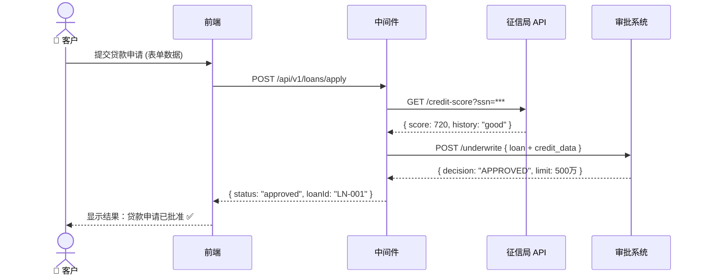

<p align="center">
  
</p>

<h1 align="center">Custom Agent AGY</h1>

<p align="center">
  <strong>专为 Antigravity CLI 打造的 8 个专业 AI Agent 套件，覆盖从需求分析、架构设计、安全编码、日志规范、质量测试到 DevOps 的软件开发全生命周期。</strong>
</p>

<p align="center">
  <a href="README.md"><strong>🇻🇳 Tiếng Việt</strong></a> | <a href="README_EN.md"><strong>🇺🇸 English</strong></a> | <a href="README_ZH.md"><strong>🇨🇳 简体中文</strong></a>
</p>

<p align="center">
  
  
  
  
  
  
</p>

---

## 目录

- [项目概述](#项目概述)
- [确定性图编排架构 (ADK 2)](#确定性图编排架构-adk-2)
- [详细设计哲学 DSL](#详细设计哲学-dsl)
- [8 大 Agent 目录](#8-大-agent-目录)
- [8 阶段流水线架构](#8-阶段流水线架构)
- [一键全局安装](#一键全局安装)
- [如何使用面板选择 Agent (`/agents`)](#如何使用面板选择-agent-agents)
- [实际应用示例](#实际应用示例)
- [BA 技巧：如何使用 AI 绘制流程图](#ba-技巧如何使用-ai-绘制流程图)
- [目录结构](#目录结构)
- [补充文档](#补充文档)
- [贡献指南](#贡献指南)
- [开源协议](#开源协议)

---

## 项目概述

**Custom Agent AGY** 是专为 [Antigravity CLI](https://antigravity.dev) (v1.1.6+) 及支持 Subagent 机制的 AI 编码助手量身定制的**生产级 Custom System Prompts** 集合。

---

## 确定性图编排架构 (ADK 2)

在 **v2.5.0** 中，系统已全面升级为符合 Google ADK 2.0 标准的**确定性有向图编排模式 (Directed Graph Topology)**：



---

## 详细设计哲学 DSL

所有 8 个 Agent 均构建于 5 大核心工程原则及 **4-Part Harness 架构**之上，并编码为机器可读的 DSL：

```yaml
# design_philosophy.dsl
version: "2.0.0"
description: "AI Agent 与软件工程师的架构设计原则"

principles:
  - id: P1
    name: "继承工业级标准 (Standardization over Reinvention)"
    rationale: "对于已有业界成熟解决方案的问题，绝不重新造轮子。"
    rule: "100% 优先使用工业级标准库 (如 pino, Zod, Prisma, Argon2, Redis)。切勿自定义加密算法、验证器或日志库。"
    boundary: "仅在当下无任何靠谱开源库满足要求时，才编写自定义代码。"
    good_example: "使用 Argon2id 进行密码哈希，使用 Zod 进行 Schema 校验，使用 Pino 进行结构化日志输出。"
    bad_example: "手写 SHA256 + Salt 密码哈希函数，或编写复杂的自定义正则表达式校验 Email。"

  - id: P2
    name: "简约设计与拒绝过早抽象 (Simplicity & YAGNI)"
    rationale: "非必要的代码即是技术债务，更是 Bug 的温床。"
    rule: "严格践行 YAGNI & KISS 原则。代码保持扁平 (Flat Code)，优先早返回 (Early Returns) 与单一职责。"
    boundary: "除非当下已有至少 3 处实际调用，否则严禁抽取抽象类、接口或通用 Helper 工具。"
    good_example: |
      if (!user) return res.status(404).json({ error: "USER_NOT_FOUND" });
      if (!user.isActive) return res.status(403).json({ error: "USER_INACTIVE" });
    bad_example: "仅为执行一条简单的 SELECT 查询就创建 GenericAbstractBaseUserRepositoryFactoryImpl。"

  - id: P3
    name: "基于经验数据的性能优化 (Data-Driven Optimization)"
    rationale: "缺乏数据支撑凭直觉优化只会增加代码复杂度，无法带来实际价值。"
    rule: "仅在 Profiler、指标监控或数据库 EXPLAIN 执行计划提供确凿证据时才进行性能优化。"
    boundary: "任何关于添加数据库索引、Redis 缓存或 Worker 线程的提议，必须附带优化前后的 Benchmark 对比。"
    good_example: "运行 EXPLAIN ANALYZE 发现全表扫描 -> 添加复合索引 (user_id, status)。"
    bad_example: "即便数据表只有 50 行静态数据，也强制给所有查询套上 Redis 缓存。"

  - id: P4
    name: "贯穿开发至生产的全流程可观测性 (Dev-to-Prod Observability)"
    rationale: "不可观测的系统无法在生产环境中稳定运行。"
    rule: "功能只有从第一行代码起内置结构化日志、Correlation ID 与错误追踪，才被视为完成 (Done)。"
    boundary: "所有 HTTP 请求、Cron Job 或消息队列必须端到端传递并继承 Correlation ID (requestId/traceId)。"
    good_example: "网关/中间件生成 X-Request-ID Header，并自动附加到该请求的每一行日志中。"
    bad_example: "在 Controller 捕捉到了异常并打印日志，却没有 Trace ID 用于追溯原始请求上下文。"

  - id: P5
    name: "每一行日志具备丰富上下文 (Context-Rich Structured Logging)"
    rule: "所有日志输出必须为 JSON 结构化格式，包含丰富上下文，便于机器与人工精准查询过滤。"
    boundary: "禁止使用 console.log('here')、console.log(err) 或无结构文本。每行日志必须回答：发生了什么？何时？涉及谁？结果如何？"
    good_example: |
      logger.info({
        timestamp: "2026-07-25T16:20:00.000Z",
        level: "info",
        traceId: "req_xyz789",
        event: "order.payment_processed",
        metadata: { orderId: "ord_123", userId: "usr_456", amount: 500000, durationMs: 142 }
      })
    bad_example: "console.log('Payment success for order ' + orderId);"

agent_structure:
  format: "4-Part Harness 架构"
  description: "每个 Agent System Prompt 的强制 4 部分结构，确保稳定性与安全防线"
  sections:
    - section: 1
      name: "ROLE & IDENTITY"
      purpose: "明确专业角色、领域边界与核心身份。"
      mandatory_elements: ["Agent 名称", "专业领域", "工作范围", "内置基础知识"]

    - section: 2
      name: "SAFETY CONSTRAINTS"
      purpose: "严格防线，防止破坏性或越界行为。"
      mandatory_elements: ["非破坏性规则", "代码修改边界", "输入校验要求", "禁止瞎猜规则"]

    - section: 3
      name: "QUALITY STANDARDS"
      purpose: "输出标准，确保交付生产级质量。"
      mandatory_elements: ["Clean Code 标准", "JSON 日志标准", "RFC 7807 错误格式", "测试与文档标准"]

    - section: 4
      name: "TOOLS & EXECUTION"
      purpose: "清晰的 3-4 步执行工作流与工具权限。"
      mandatory_elements: ["可用工具列表", "分步执行工作流", "输出格式模板"]
```

---

## 8 大 Agent 目录



| # | Agent 名称 | Prompt 文件 | 职责描述 | 工具链 |
|:-:|-----------|-------------|----------|-------|
| ① | **BA Requirements Specialist** | [`ba-requirements-specialist.md`](ba-requirements-specialist.md) | 需求工程、User Stories、Gherkin 标准 Acceptance Criteria、NFRs | read, write, search_web |
| ② | **API & DB Architect** | [`api-db-architect.md`](api-db-architect.md) | REST/GraphQL API 契约、DB Schema、RFC 7807 错误标准、日志契约 | read, write |
| ③ | **QC Verification Specialist** | [`qc-verification-specialist.md`](qc-verification-specialist.md) | 测试矩阵、AAA 模式单元/集成测试、日志验证、回归测试 | read, write, shell |
| ④ | **Codebase Researcher** | [`codebase-researcher.md`](codebase-researcher.md) | 代码库扫描、模式挖掘、日志审计、影响分析、Roadmap 规划 | read, shell, search_web |
| ⑤ | **Developer & Security** | [`dev-security-implementer.md`](dev-security-implementer.md) | 安全编码、Auth/RBAC、JSON 结构化日志、自定义异常类 | read, write, shell |
| ⑥ | **Logging & Observability** | [`logging-observability-specialist.md`](logging-observability-specialist.md) | 日志 Schema 设计、Logger 配置 (pino/structlog)、Correlation ID、全局异常捕捉 | read, write, shell, search_web |
| ⑦ | **Docs & README** | [`docs-readme-specialist.md`](docs-readme-specialist.md) | README 生成、双层 .gitignore、CHANGELOG、.env.example、架构图生成 | read, write, search_web, generate_image |
| ⑧ | **DevOps & Git** | [`devops-git-specialist.md`](devops-git-specialist.md) | Conventional Commits 规范、GitHub Flow、CI/CD Pipeline (GitHub Actions)、SemVer 版本发布 | read, write, shell |

---

## 8 阶段流水线架构

### 详细 Sequence Diagram



---

## 一键全局安装

克隆仓库后，仅需运行**一条命令**即可将全部 8 个 Agent 自动安装至全局配置目录 (`~/.gemini/config/agents/`)：

### Windows (PowerShell)：

```powershell
.\scripts\setup_global.ps1
```

### Linux / macOS (Bash)：

```bash
bash scripts/setup_global.sh
```

---

## 如何使用面板选择 Agent (`/agents`)

在 Antigravity CLI 中输入以下命令唤出交互式 TUI 面板：

```bash
/agents
```

---

## 实际应用示例

### 用例：构建认证系统 (Authentication)



---

## BA 技巧：如何使用 AI 绘制流程图

> **实用技巧：** 除了编写代码，本 Agent 套件还支持 BA/PM 利用 AI 创建专业技术文档与可视化流程图。

### 解决方案：使用 AI Agent + Mermaid/PlantUML



---

## 目录结构

```
custom_agent_agy/
├── README.md                              # 越南语 README
├── README_EN.md                           # 英文 README
├── README_ZH.md                           # 简体中文 README
├── LICENSE                                # MIT License
├── CONTRIBUTING.md                        # 贡献指南
├── CODE_OF_CONDUCT.md                     # 社区行为准则
├── SECURITY.md                            # 安全策略
├── .gitignore                             # Git 忽略规则 (双层)
├── full_lifecycle_workflow_guide.md        # 8 阶段工作流指南
│
├── .github/
│   ├── ISSUE_TEMPLATE/
│   │   ├── bug_report.yml                 # Bug 报告模板
│   │   └── feature_request.yml            # 功能请求模板
│   ├── PULL_REQUEST_TEMPLATE.md           # PR 检查清单
│   └── workflows/
│       └── ci.yml                         # GitHub Actions CI
│
├── assets/
│   └── banner.jpg                         # 仓库 Banner 图片
├── scripts/
│   ├── setup_global.ps1                   # Windows 一键安装脚本
│   └── setup_global.sh                    # Linux/macOS 一键安装脚本
├── docs/
│   ├── USAGE_GUIDE.md                     # 各 Agent 详细使用手册
│   └── TIPS_BA_AI_FLOW.md                 # BA AI 流程图技巧
│
├── ba-requirements-specialist.md          # ① BA Agent
├── api-db-architect.md                    # ② Architect Agent
├── qc-verification-specialist.md          # ③ QC Agent
├── codebase-researcher.md                 # ④ Researcher Agent
├── dev-security-implementer.md            # ⑤ Developer Agent
├── logging-observability-specialist.md    # ⑥ Logging Agent
├── docs-readme-specialist.md              # ⑦ Docs Agent
└── devops-git-specialist.md               # ⑧ DevOps Agent
```

---

## 补充文档

| 文档 | 描述 |
|------|------|
| [英文版 (English)](README_EN.md) | Custom Agent AGY 英文完整文档 |
| [越南语版 (Vietnamese)](README.md) | Custom Agent AGY 越南语完整文档 |
| [Workflow Guide](full_lifecycle_workflow_guide.md) | 8 阶段流水线编排指南与并行执行规则 |
| [Usage Guide](docs/USAGE_GUIDE.md) | 各 Agent 详细使用手册：目标、Prompt 模板与输出示例 |
| [BA AI Flow Tips](docs/TIPS_BA_AI_FLOW.md) | BA 使用 AI 绘制流程图与撰写 BRD 文档指南 |

---

## 贡献指南

欢迎提交 Issue 或 Pull Request！请参阅 [CONTRIBUTING.md](CONTRIBUTING.md) 了解详细规范。

---

## 开源协议

基于 [MIT License](LICENSE) 开源。

---

<p align="center">
  <strong>Built with ❤️ by <a href="https://github.com/Le-Ngoc-Tu">Le Ngoc Tu</a></strong>
</p>
