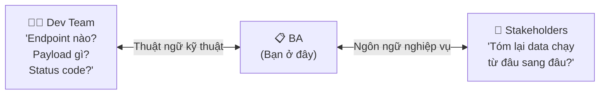
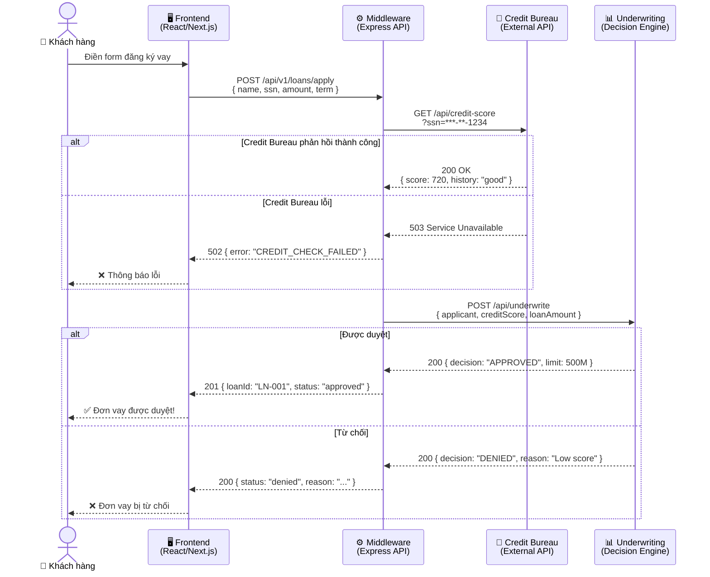
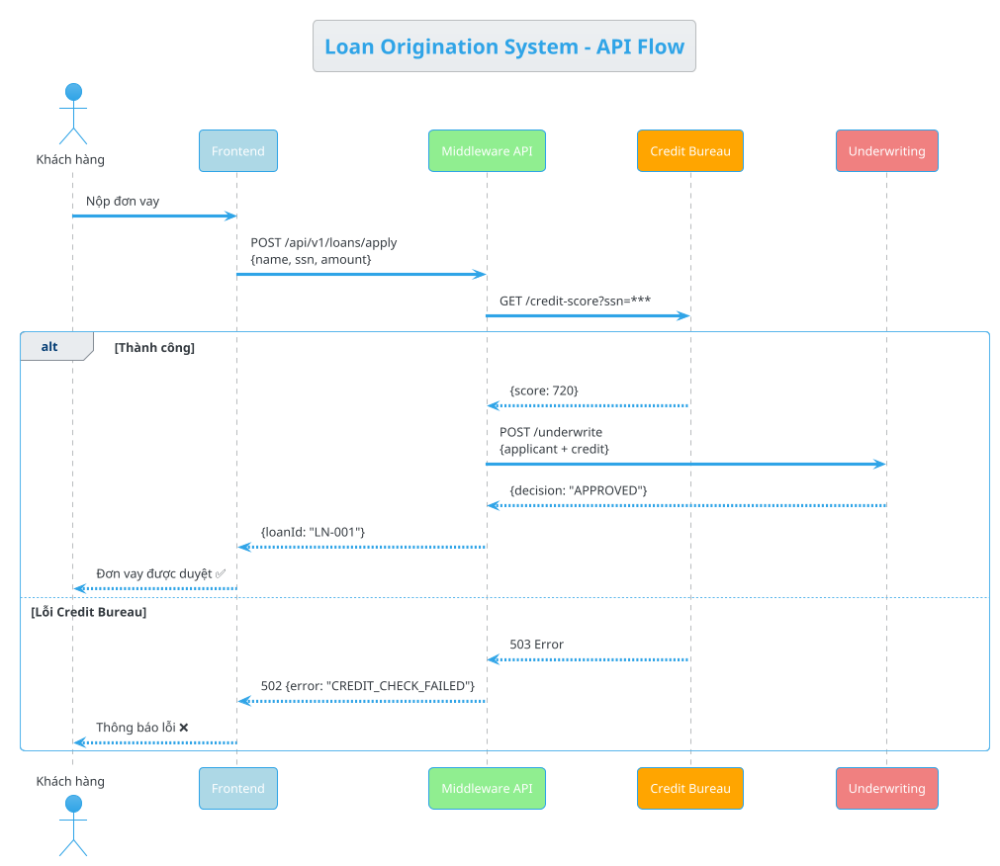
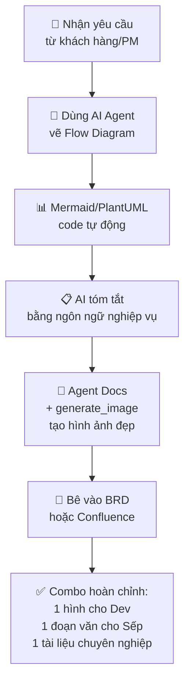

# Tips & Tricks: BA Dùng AI Agent Vẽ Flow Diagrams Nhanh Gọn Lẹ

> **Tóm tắt:** Hướng dẫn Business Analysts sử dụng AI Agents (Antigravity, ChatGPT, Claude) để vẽ API Flow Diagrams bằng Mermaid/PlantUML, tạo tài liệu BRD chuyên nghiệp có hình ảnh đẹp mắt — tiết kiệm hàng giờ kéo thả mũi tên.

---

## Vấn Đề Thực Tế

Làm BA, bạn thường đứng giữa ngã ba đường:



**Giải pháp:** Dùng AI Agent vẽ diagram tự động, tạo ra **2 phiên bản** cùng lúc:
1. **Bản kỹ thuật** cho Dev (có endpoint, payload, status code)
2. **Bản nghiệp vụ** cho Stakeholders (ngôn ngữ dễ hiểu)

---

## Ví Dụ Thực Tế: Loan Origination System

### Bối cảnh nghiệp vụ

Bạn đang làm quy trình cho hệ thống khởi tạo khoản vay:

1. Khách hàng nộp form đăng ký vay
2. Hệ thống gọi API sang Credit Bureau để check điểm tín dụng
3. Nhận điểm Credit Score về
4. Đẩy data qua hệ thống Thẩm định (Underwriting) để ra quyết định

### Bước 1: Prompt AI vẽ Flow Diagram

**Prompt cho Antigravity / Claude / ChatGPT:**

```
Vẽ API flow diagram cho Loan Origination System:
- User nộp form → Frontend
- Frontend gọi Middleware API
- Middleware gọi Credit Bureau API để lấy credit score
- Middleware tổng hợp data gửi sang Underwriting API
- Underwriting trả quyết định → hiển thị cho user

Yêu cầu:
1. Dùng Mermaid sequence diagram
2. Label rõ từng component và API endpoint
3. Hiển thị request/response data
4. Thêm error handling flow
```

### Output Mermaid (Bản kỹ thuật)



### Bước 2: Prompt AI tóm tắt bằng ngôn ngữ nghiệp vụ

```
Viết lại giải thích flow trên bằng ngôn ngữ nghiệp vụ đơn giản
cho stakeholders không rành kỹ thuật.
```

**Output (Bản nghiệp vụ):**

> Khi khách hàng nộp đơn xin vay trên trang web, hệ thống thực hiện 3 bước tự động:
>
> **Bước 1 — Tiếp nhận:** Hệ thống ghi nhận thông tin cá nhân và số tiền muốn vay.
>
> **Bước 2 — Kiểm tra tín dụng:** Hệ thống gọi sang Trung tâm Thông tin Tín dụng Quốc gia để truy vấn lịch sử tín dụng và điểm uy tín của khách hàng. Nếu trung tâm không phản hồi, hệ thống thông báo lỗi và yêu cầu khách hàng thử lại sau.
>
> **Bước 3 — Thẩm định:** Toàn bộ hồ sơ (thông tin + điểm tín dụng) được gửi sang hệ thống Thẩm định tự động. Hệ thống ra quyết định: phê duyệt hoặc từ chối, kèm lý do rõ ràng.
>
> Kết quả hiển thị ngay trên màn hình cho khách hàng.

### Bước 3: Tạo hình ảnh đẹp cho tài liệu BRD

Kết hợp agent `⑦ Docs & README` với tool `generate_image`:

```
Dùng agent docs-readme-specialist với tool generate_image để tạo
ảnh architecture diagram chuyên nghiệp cho Loan Origination System.
Style: Clean, professional, màu xanh dương chủ đạo,
có icon cho từng component, font rõ ràng.
```

---

## PlantUML Alternative

Nếu team dùng PlantUML (paste vào [PlantUML Editor](https://www.plantuml.com/plantuml/uml)):



---

## Tổng Hợp: Quy Trình BA Tạo Tài Liệu Chuyên Nghiệp



### Checklist tạo tài liệu chuyên nghiệp chuẩn Việt Nam

- [ ] **Font chữ:** Dùng font chuẩn (Arial, Roboto, Noto Sans) — hỗ trợ tiếng Việt có dấu
- [ ] **Màu sắc:** Tông xanh dương chủ đạo (#2563EB), phụ xám (#6B7280), accent cam (#F59E0B)
- [ ] **Heading:** Tiêu đề rõ ràng, có đánh số mục (1., 1.1., 1.1.1.)
- [ ] **Bảng:** Dùng bảng cho dữ liệu so sánh, specs, danh sách API
- [ ] **Diagram:** Mỗi luồng xử lý phải có ít nhất 1 hình minh họa
- [ ] **Giải thích:** Kèm 1 đoạn văn ngắn dưới mỗi diagram
- [ ] **Tiếng Việt:** Thuật ngữ kỹ thuật giữ tiếng Anh, nội dung diễn giải bằng tiếng Việt

---

## Prompt Templates Sẵn Dùng

### Template 1: Vẽ API Flow

```
Vẽ API flow diagram cho [TÊN HỆ THỐNG] bằng Mermaid sequence diagram.
Các bước:
1. [Bước 1]
2. [Bước 2]
...
Yêu cầu: Label component, hiển thị endpoint + payload, thêm error handling.
```

### Template 2: Tóm tắt nghiệp vụ

```
Viết lại flow trên bằng ngôn ngữ nghiệp vụ cho stakeholders
không rành kỹ thuật. Tối đa 5 câu, dùng bullet points.
```

### Template 3: Tạo hình minh họa

```
Dùng tool generate_image tạo architecture diagram cho [TÊN HỆ THỐNG].
Style: Clean, professional, tông xanh dương, có icon cho từng component.
```

---

*Lưu các prompt templates này để dùng khi cần — tiết kiệm hàng giờ kéo thả mũi tên!*
