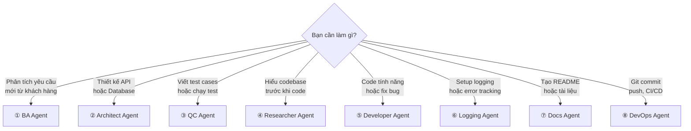
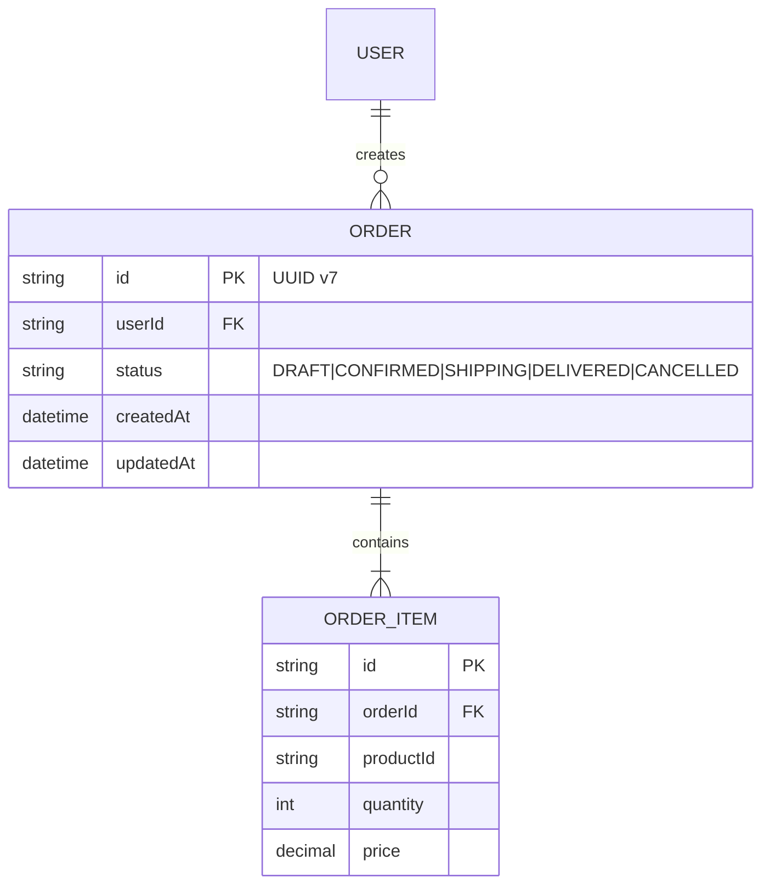
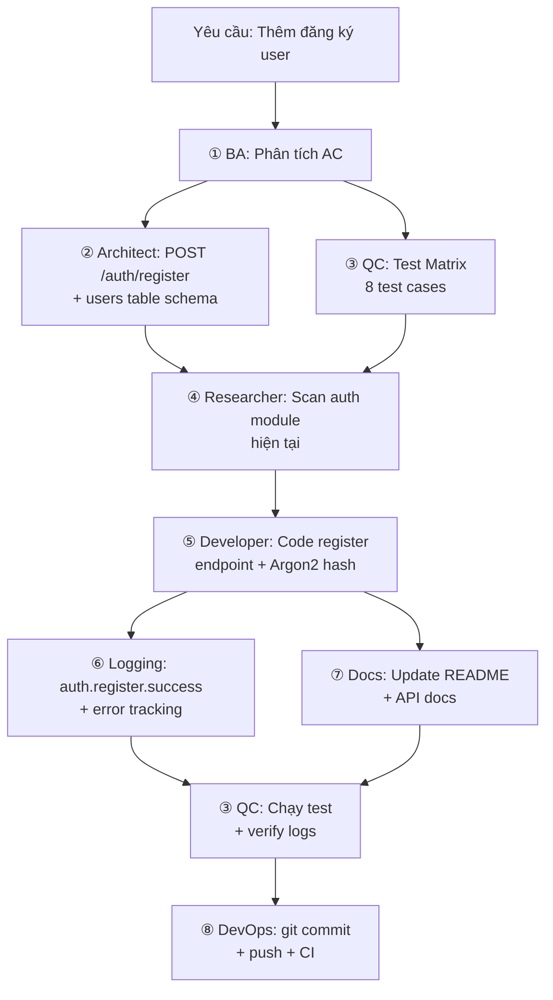

# Hướng Dẫn Sử Dụng Chi Tiết — Custom Agent AGY

Tài liệu này mô tả chi tiết cách sử dụng từng agent trong bộ Custom Agent AGY, bao gồm: mục đích, khi nào dùng, prompt mẫu và output kỳ vọng.

---

## Tổng Quan Nhanh



---

## ① BA Requirements Specialist

### Khi nào dùng

- Bắt đầu tính năng mới, yêu cầu còn mơ hồ
- Cần phân tích và làm rõ phạm vi dự án
- Cần viết User Stories & Acceptance Criteria chuẩn Gherkin
- Cần vẽ Business Flow Diagram

### Prompt mẫu

```
Phân tích yêu cầu cho hệ thống quản lý đơn hàng (Order Management):
- Khách hàng có thể tạo đơn, xem lịch sử, hủy đơn trong vòng 30 phút
- Admin có thể duyệt, giao hàng, xác nhận hoàn thành
- Cần gửi email thông báo mỗi khi trạng thái đơn thay đổi
```

### Output kỳ vọng

Agent sẽ trả về:
- Business Flow (Mermaid sequence diagram)
- User Stories (US-01, US-02...) với AC viết theo Given-When-Then
- Business Rules (BR-01, BR-02...)
- Non-Functional Requirements (Performance, Logging, Security)

---

## ② API & DB Architect

### Khi nào dùng

- Sau khi có bản Requirements từ BA
- Cần thiết kế Endpoints, Request/Response format
- Cần thiết kế Database Schema + Migration
- Cần định nghĩa Error Response Standard

### Prompt mẫu

```
Dựa trên User Stories cho Order Management, thiết kế:
1. API Endpoints chuẩn RESTful
2. Database Schema (Prisma format)
3. Error Response Standard theo RFC 7807
4. Logging Contract cho từng endpoint
```

### Output kỳ vọng



---

## ③ QC Verification Specialist

### Khi nào dùng

- Sau khi code hoàn thành, cần viết/chạy tests
- Cần thiết kế Test Matrix phủ edge cases
- Cần verify structured logging output
- Cần tạo regression test từ production bug

### Prompt mẫu

```
Dựa trên AC của Order Management, thiết kế Test Matrix và viết
Unit Tests (Jest) cho orderService.createOrder():
- Happy path: tạo đơn thành công
- Edge case: tạo đơn với giỏ hàng rỗng
- Edge case: tạo đơn khi user bị locked
- Security: tạo đơn với userId giả mạo
```

---

## ④ Codebase Researcher

### Khi nào dùng

- Onboard vào dự án mới, cần hiểu kiến trúc
- Trước khi code tính năng lớn, cần nắm conventions
- Cần audit logging & error handling patterns hiện tại
- Cần Impact Analysis cho thay đổi sắp tới

### Prompt mẫu

```
Scan codebase của dự án hiện tại để:
1. Xác định tech stack, framework, ORM
2. Phát hiện naming conventions và error handling pattern
3. Audit hệ thống logging (có structured? có correlation ID?)
4. Lập Impact Analysis cho việc thêm module Order
```

---

## ⑤ Developer & Security

### Khi nào dùng

- Khi đã có API Contracts, DB Schema và Roadmap
- Cần implement code với structured logging
- Cần tích hợp Auth/RBAC
- Cần fix bug hoặc gỡ dead code

### Prompt mẫu

```
Implement orderService.createOrder() theo:
- API Contract đã thiết kế: POST /api/v1/orders
- Sử dụng Prisma ORM
- Tích hợp structured logging (pino, JSON format)
- Validation bằng Zod
- Error handling dùng Custom AppError classes
```

---

## ⑥ Logging & Observability Specialist

### Khi nào dùng

- Khởi tạo hệ thống logging cho dự án mới
- Audit hệ thống logging hiện tại (tìm console.log, swallowed errors)
- Thiết lập Correlation ID middleware
- Chuẩn hóa Log Level Policy cho team

### Prompt mẫu

```
Thiết lập hệ thống logging hoàn chỉnh cho dự án Express.js:
1. Logger setup (pino, JSON structured)
2. Correlation ID middleware (X-Request-ID)
3. Global Error Handler
4. Custom Error Classes (AppError hierarchy)
5. Log Level Policy (dev: debug, prod: info)
```

---

## ⑦ Docs & README Specialist

### Khi nào dùng

- Dự án cần README.md chuyên nghiệp
- Cần tạo .gitignore, .env.example, CHANGELOG
- Cần tạo Architecture Diagram cho tài liệu BRD
- Cần tạo tài liệu có hình ảnh đẹp mắt

### Prompt mẫu

```
Tạo README.md chuyên nghiệp cho dự án Order Management API:
- Scan package.json để detect tech stack
- Tạo Getting Started copy-pasteable
- Tạo Project Structure tree
- Tạo .gitignore và .env.example
- Dùng generate_image tạo architecture diagram
```

---

## ⑧ DevOps & Git Specialist

### Khi nào dùng

- Code và docs hoàn thành, cần commit/push
- Cần thiết lập CI/CD pipeline (GitHub Actions)
- Cần tạo release tag (SemVer)
- Cần enforce Conventional Commits cho team

### Prompt mẫu

```
Commit và push code lên GitHub:
1. Stage all changes
2. Commit theo Conventional Commits format
3. Push lên branch main
4. Tạo GitHub Actions CI pipeline (lint, test, build)
5. Tag release v1.0.0
```

---

## Kết Hợp Nhiều Agents

### Ví dụ: Full pipeline cho feature "User Registration"


