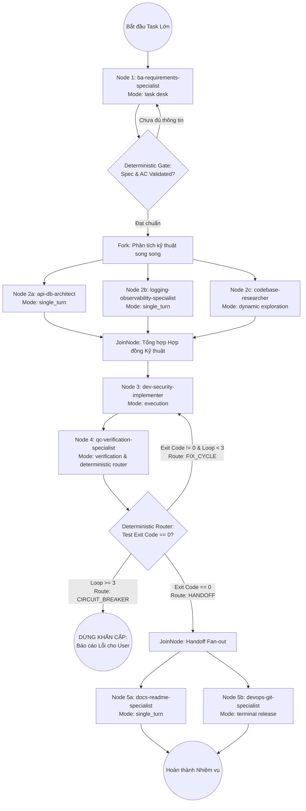

# Hướng Dẫn Sử Dụng & Điều Phối Bộ Custom Agents theo Chuẩn Graph Engineering & Google ADK 2 (v2.5.0)

Tài liệu này hướng dẫn cách nạp và điều phối bộ **8 Custom Subagents** theo mô hình **Đồ thị Điều phối Xác định (Deterministic Graph Orchestration)** trong Antigravity AI Assistant, giải quyết triệt để vấn đề context drift và vòng lặp thiếu kiểm soát.

---

## 1. Triết Lý Điều Phối Cốt Lõi (Core Mental Model)

> *"Predictable work stays as functions; clear rules become explicit routing; reasoning uses the model."*

Hệ thống phân rã quy trình thành đồ thị có hướng (Directed Graph) dựa trên 3 trụ cột của Google ADK 2:
- **Pillar 1 (Graph Workflows & Deterministic Gates):** Phân luồng và rẽ nhánh dựa trên mã thoát shell thực tế (`Exit Code`), có rào chắn đồng bộ `JoinNode`.
- **Pillar 2 (Collaborative Modes & Task Desk):** Sử dụng `mode="task"` cho khâu làm rõ yêu cầu (hội thoại có điểm dừng xác thực) và `mode="single_turn"` cho các chuyên gia công cụ có cấu trúc dữ liệu chặt chẽ.
- **Pillar 3 (Dynamic Workflows & Phanh An Toàn):** Dynamic Fan-out phân rã bài toán lớn thành các nhánh con song song, bọc phanh hãm cứng (`MAX_ITERATIONS = 3`, Circuit Breaker) chống cạn kiệt token.

---

## 2. Danh Sách 8 Custom Agents & Vai Trò Graph Node

| # | Tên Subagent | Graph Node Type & Mode | Vai trò chính & Hợp đồng dữ liệu | Tools |
|---|-------------|------------------------|-----------------------------------|-------|
| ① | `ba-requirements-specialist` | `Input Boundary Node`<br/>`mode="task"` | Thu thập yêu cầu có điểm dừng xác thực; phát ra `AcceptanceCriteriaContract` (Gherkin AC). | read, write, search_web |
| ② | `api-db-architect` | `Data & Contract Node`<br/>`mode="single_turn"` | API Contracts (REST/GraphQL), DB Schema, RFC 7807 Error Code, Keyset Pagination. | read, write |
| ③ | `logging-observability-specialist` | `Observability Node`<br/>`mode="single_turn"` | JSON Log Schema, Correlation ID (`X-Request-ID`), Log Event Matrix, Custom Error Classes. | read, write, shell, search_web |
| ④ | `codebase-researcher` | `Exploration Node`<br/>`mode="single_turn"` (Dynamic Fan-out) | Scan codebase, Blast Radius, Pattern Learning, trả về `CodebaseImpactReport`. | read, shell, search_web |
| ⑤ | `dev-security-implementer` | `Primary Execution Node`<br/>`mode="execution"` | Code an toàn theo hợp đồng; tiếp nhận `ROUTE="FIX_CYCLE"` để sửa lỗi phẫu thuật (Surgical fix). | read, write, shell |
| ⑥ | `qc-verification-specialist` | `Deterministic Quality Router`<br/>`mode="verification"` | Chạy test shell thật; rẽ nhánh xác định: `HANDOFF` (pass), `FIX_CYCLE` (lỗi < 3), `CIRCUIT_BREAKER` (lỗi >= 3). | read, write, shell |
| ⑦ | `docs-readme-specialist` | `Documentation Worker`<br/>`mode="single_turn"` (Parallel Fan-out) | Cập nhật README.md, CHANGELOG.md, .env.example, Mermaid diagrams song song ở pha cuối. | read, write, search_web, generate_image |
| ⑧ | `devops-git-specialist` | `Release & Terminal Node`<br/>`mode="single_turn"` (Terminal) | Soát xét git diff clean, Conventional Commits, CI/CD Pipeline, chuyển sang `TERMINAL_END`. | read, write, shell |

---

## 3. Kiến Trúc Đồ Thị Điều Phối (Complete Graph Topology)



---

## 4. Quản Lý Trạng Thái Có Kiểu (Typed State Schema)

Để chống trôi mục tiêu (context drift) trên các tác vụ lớn, trạng thái hệ thống được lưu vết trực tiếp trong `task_plan.md` ở thư mục gốc dự án (sử dụng mẫu tại `templates/task_plan_template.md`):

```yaml
---
task_id: "feature-payment-v2"
current_node: "NODE_QC"
iteration_count: 1
max_iterations: 3
deterministic_gates:
  spec_validated: true
  build_exit_code: 0
  test_exit_code: 0
route: "HANDOFF"
active_subagents: ["docs-readme-specialist", "devops-git-specialist"]
modified_files: ["src/payment/service.ts", "tests/payment.test.ts"]
---
```

---

## 5. Cách Sử Dụng Trong Antigravity CLI

### Cách 1: Tự động qua Global Config (Khuyến nghị)
Chạy script cài đặt 1 lần duy nhất:
```powershell
./scripts/setup_global.ps1
```
Sau đó trong bất kỳ phiên làm việc nào với Antigravity CLI, hệ thống sẽ tự động nhận diện và kích hoạt mạng lưới tác tử theo quy tắc của `~/.gemini/GEMINI.md`.

### Cách 2: Yêu cầu tường minh theo luồng Graph
> "Hãy kích hoạt quy trình Graph Workflow cho tính năng: **[Mô tả tính năng]** với task_plan.md theo template chuẩn."
