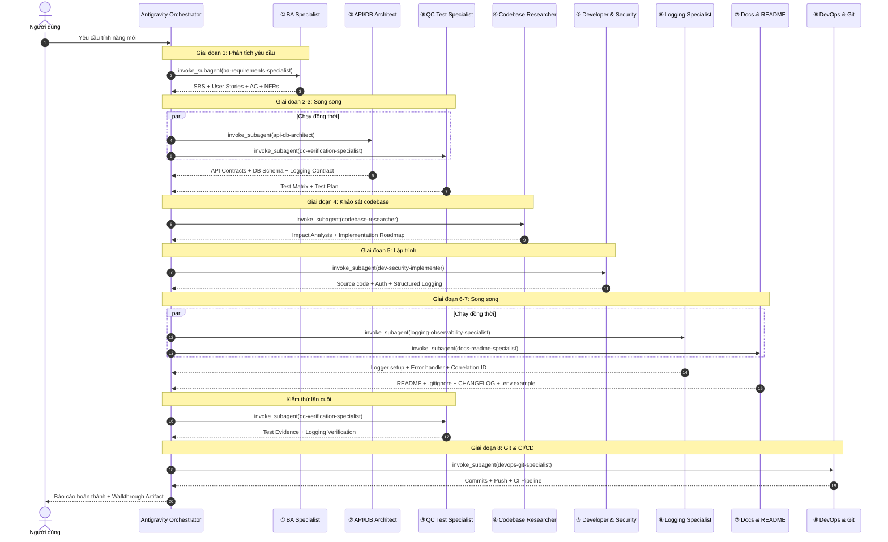

# Hướng Dẫn Sử Dụng & Điều Phối Bộ Custom Agents v2.0

Tài liệu này hướng dẫn cách nạp và điều phối bộ **8 Custom Subagents** theo quy trình **Full Software Pipeline (8 Giai Đoạn)** trong Antigravity AI Assistant.

---

## Danh Sách Custom Agents

| # | Tên Subagent | File | Vai trò chính | Tools |
|---|-------------|------|---------------|-------|
| ① | `ba-requirements-specialist` | `ba-requirements-specialist.md` | Phân tích yêu cầu, User Stories, AC (Gherkin), NFRs | read, write, search_web |
| ② | `api-db-architect` | `api-db-architect.md` | API Contracts (REST/GraphQL), DB Schema, Error Standard (RFC 7807), Logging Contract | read, write |
| ③ | `qc-verification-specialist` | `qc-verification-specialist.md` | Test Matrix, Automation Tests, Log Verification, Regression from Production | read, write, shell |
| ④ | `codebase-researcher` | `codebase-researcher.md` | Scan codebase, Pattern Learning, Logging Audit, Impact Analysis, Roadmap | read, shell, search_web |
| ⑤ | `dev-security-implementer` | `dev-security-implementer.md` | Code implementation, Auth/RBAC, Structured Logging (JSON), Custom Error Classes | read, write, shell |
| ⑥ | `logging-observability-specialist` | `logging-observability-specialist.md` | Log Schema Design, Logger Setup, Correlation ID, Error Tracking, Log Level Policy | read, write, shell, search_web |
| ⑦ | `docs-readme-specialist` | `docs-readme-specialist.md` | README.md, .gitignore, CHANGELOG.md, .env.example, API Docs | read, write, search_web, generate_image |
| ⑧ | `devops-git-specialist` | `devops-git-specialist.md` | Conventional Commits, Branch Strategy, CI/CD Pipeline (GitHub Actions), Release (SemVer) | read, write, shell |

---

## Quy Trình 8 Giai Đoạn (Full Software Pipeline)



---

## Parallel Execution Map

```
TUẦN TỰ BẮT BUỘC:
  ① BA → ④ Researcher → ⑤ Developer → ⑧ DevOps

SONG SONG ĐƯỢC:
  ② Architect  ⟷  ③ QC Test     (sau ① BA, trước ④ Researcher)
  ⑥ Logging    ⟷  ⑦ Docs        (sau ⑤ Developer, trước ⑧ DevOps)

SƠ ĐỒ THỜI GIAN:
  T1: ① BA
  T2: ② Architect + ③ QC Test (song song)
  T3: ④ Researcher
  T4: ⑤ Developer
  T5: ⑥ Logging + ⑦ Docs (song song)
  T6: ③ QC Test (lần 2 - verify)
  T7: ⑧ DevOps
```

---

## Cách Khởi Tạo Agent Trong Antigravity

### Cách 1: Yêu cầu tự nhiên (Khuyến nghị)

Chỉ cần nói với Antigravity:

> "Hãy đọc file `E:\agent_resources\antigravity_custom_agents\ba-requirements-specialist.md` và dùng nội dung đó làm system prompt để define_subagent, sau đó invoke nó để phân tích yêu cầu cho tính năng [X]."

### Cách 2: Kích hoạt toàn bộ pipeline

> "Hãy dùng bộ custom agents trong `E:\agent_resources\antigravity_custom_agents\` theo quy trình 8 giai đoạn để phát triển tính năng: **[Mô tả tính năng]**"

### Cách 3: Kích hoạt từng agent riêng lẻ

Antigravity sẽ đọc file `.md` tương ứng và dùng `define_subagent` để nạp agent:

```json
{
  "name": "ba-requirements-specialist",
  "description": "Agent chuyên gia BA...",
  "system_prompt": "<Nội dung từ file .md>",
  "enable_write_tools": true,
  "enable_mcp_tools": false
}
```

---

## Triết Lý Thiết Kế (Design Principles)

Tất cả agents đều tuân thủ:

1. **Cấu trúc 4 phần chuẩn** — Role & Identity, Safety Constraints, Quality Standards, Tools & Execution
2. **Lựa chọn hơn nỗ lực** — Chọn thư viện chuẩn công nghiệp, không tự chế
3. **Đơn giản hơn phức tạp** — Minimal viable solution, early return, single responsibility
4. **Mỗi dòng log phải có ý nghĩa** — JSON structured, correlation ID, severity levels chuẩn
5. **Evidence-based** — Không đoán, không giả định, mọi kết luận phải trỏ về file thực tế
6. **Human-in-the-Loop** — Hành động nguy hiểm (DROP TABLE, git push --force, deploy) luôn hỏi user trước
